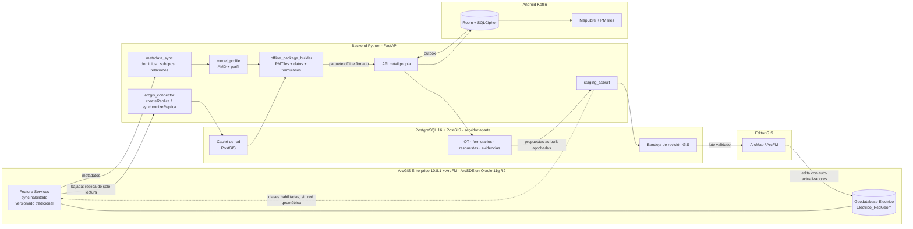

# Addendum 01 — Plataforma de campo tipo Field Maps sobre ArcGIS 10.8.1

| Campo | Valor |
|---|---|
| Código | ADD-SIGEC-001 |
| Versión | 1.1 |
| Fecha | 21 de septiembre de 2026 |
| Extiende a | `SRS.md` v1.1 (SRS-SIGEC-CAMPO-001) |
| Complementa a | `GUIA_ENTRENAMIENTO_MODELOS.md` v1.1 · `modelo-datos-cnel/` |
| Estado | Borrador para aprobación — define el punto de partida de `PLAN_IMPLEMENTACION.md` |
| Cambios v1.2 | La integración con el GIS pasa a un **agente arcpy** (Python 2.7 / ArcMap 10.8.1) que es el único componente que toca la geodatabase, en ambos sentidos (ADR-008). Con ello los feature services con sync dejan de ser prerrequisito y R-N2/D5 salen del camino crítico. Confirmado que la aplicación de lotes se automatiza con arcpy, sin ArcObjects. |
| Cambios v1.1 | El motor es **Oracle 11g R2 sin la opción Spatial**, dedicado a la geodatabase ArcSDE. La base operativa de la plataforma pasa a **PostgreSQL + PostGIS en servidor aparte** (ADR-006, sustituye a ADR-002). **El RAG normativo sale de v1** (ADR-007, sustituye a ADR-005). Se descarta expresamente el SDK de Esri en el móvil. La aplicación en ArcFM la ejecuta el equipo de la distribuidora. |

## 0. Por qué existe este documento

El SRS v1.1 especifica la plataforma asumiendo **PostgreSQL/PostGIS** como base y un **conector GIS genérico** (RF-121), y deja abierta la decisión 11.3.2 (*"GIS corporativo: ¿ArcGIS/ArcFM u otro?"*).

Ese punto ya está resuelto y con ello cambian tres cimientos de la arquitectura:

1. El GIS corporativo es **ArcGIS 10.8.1 con ArcFM sobre geodatabase ArcSDE en Oracle 11g R2**, con el modelo de datos nacional de CNEL EP documentado en `modelo-datos-cnel/` (47 clases, 196 dominios, 79 relaciones, red geométrica `Electrico_RedGeom`).
2. Ese Oracle **queda dedicado a la geodatabase**. No aloja datos de la plataforma, y se accede solo a través de ArcSDE y los feature services — nunca por SQL directo (ADR-006).
3. La experiencia de usuario se modela sobre **ArcGIS Field Maps**: mapa primero, asignación de trabajo a dispositivos, formularios derivados del esquema de las capas, y todo funcionando sin conexión. Pero **sin usar software de Esri en el móvil**: la app es Kotlin nativo y open source (ADR-003).

Además se incorporan requerimientos nuevos que el SRS no cubría: independencia real del modelo de datos, carga de trabajos desde un sistema de órdenes externo **y desde revisiones de calidad del SIG**, reasignación de trabajo entre dispositivos, y planificadores múltiples.

Este addendum **no reemplaza al SRS**: lo corrige donde ya no aplica (sección 9), lo extiende con requerimientos `RF-3xx` (sección 8) y fija las decisiones de arquitectura (sección 2). Todo lo demás del SRS sigue vigente: formularios como datos, la IA propone y el humano dispone, offline primero, política de licencias, capa de agentes y MLOps.

---

## 1. Análisis de ArcGIS Field Maps: qué copiar y qué no

Field Maps no es una app de formularios con un mapa adentro. Es un **motor genérico que se configura con metadatos**. Esa es la propiedad que hay que replicar, y es exactamente la misma idea que el SRS ya exige en su regla 0.4 ("formularios como datos, nunca como código") — solo que Field Maps la lleva un nivel más abajo: los formularios no se diseñan, se **derivan del esquema de la capa**.

### 1.1 Anatomía de Field Maps

| Pieza | Qué hace | De dónde saca su configuración |
|---|---|---|
| **Field Maps Designer** (web) | El administrador elige capas, define el formulario, las expresiones y las áreas offline | Esquema del feature layer: campos, tipos, **dominios** (listas de valores), **subtipos**, relaciones y adjuntos |
| **Formulario (Smart Form)** | Renderiza el formulario de captura | Metadatos de la capa + reglas Arcade (visibilidad condicional, valores calculados, validaciones) |
| **Offline map areas** | Paquetes descargables (teselas + datos) por zona | Definidos por el administrador; el móvil los descarga completos |
| **Sync** | Baja y sube ediciones, adjuntos y registros relacionados | `createReplica` / `synchronizeReplica` del feature service |
| **Tasks / Workforce** | Asignación de trabajo: despachador crea, trabajador ejecuta | Capas de esquema fijo (`assignments`, `workers`, `dispatchers`) con un campo `workOrderId` como clave foránea al sistema externo |
| **Integraciones de app** | Salta a Navigator, Survey123, etc. | URL schemes configurados |

Dos aprendizajes concretos del esquema de Workforce que adoptamos tal cual:

- **Una capa de asignaciones con clave foránea externa.** El campo `workOrderId` de Workforce existe precisamente para que un sistema de órdenes de trabajo ajeno sea el dueño del número de OT. Es el patrón correcto para el *modo satélite* de RF-120.
- **Asignación como dato, no como estado interno.** El trabajador, el despachador y la asignación son entidades separadas y versionadas. Eso hace trivial reasignar trabajo entre dispositivos y tener varios planificadores sin colisiones.

### 1.2 Qué copiamos, qué mejoramos, qué descartamos

| Capacidad Field Maps | Decisión | Nota |
|---|---|---|
| Formulario derivado del esquema de la capa | **Copiar y extender** | Es el núcleo de la independencia del modelo de datos (sección 3) |
| Dominios y subtipos como fuente de catálogos | **Copiar** | Elimina el mantenimiento manual de catálogos; resuelve el aviso de `01_Dominios.md` de no hardcodear listas |
| Expresiones Arcade para lógica de formulario | **Sustituir** por JSON Logic | El SRS ya lo exige (stack 7.2) y permite la misma semántica en web, Android y backend. Arcade es propietario |
| Offline map areas | **Copiar el concepto, cambiar la implementación** | Paquetes por zona, pero con PMTiles/MBTiles + MapLibre (sección 5.4) |
| Sync por `createReplica` | **Copiar, pero en el backend** | El móvil no habla ArcGIS; ver ADR-003 |
| Tasks / Workforce | **Copiar y extender** | Añadimos planificadores múltiples con ámbito, y reasignación con reconciliación de trabajo en curso (sección 4) |
| Captura por voz | **No existe en Field Maps** | Diferenciador propio (M06 del SRS) |
| Visión on-device | **No existe en Field Maps** | Diferenciador propio (M08 del SRS) |
| Pre-revisión por agentes | **No existe en Field Maps** | Diferenciador propio (M17 del SRS) |
| Field Maps como app | **No usarlo** | No permite IA on-device, ni la lógica normativa ecuatoriana, ni el flujo ATS bloqueante. Se construye app propia (R3 del SRS) |

> **Criterio rector:** todo lo que Field Maps hace por metadatos, nosotros lo hacemos por metadatos. Todo lo que Field Maps no hace, lo añadimos como capa encima — nunca a costa de volver a codificar formularios a mano.

---

## 2. Decisiones de arquitectura

Registradas como ADR en `docs/adr/`. Resumen y consecuencias:

| # | Decisión | Consecuencia principal |
|---|---|---|
| **ADR-001** | Los cambios de red llegan al GIS por **staging + revisión en ArcFM**, nunca por escritura directa | El GIS conserva su integridad y sus auto-actualizadores; se necesita una bandeja de revisión GIS y un rol de editor GIS |
| **ADR-002** | ~~La plataforma vive en Oracle, esquema aparte del SDE~~ | **Sustituida por ADR-006** al conocerse que el motor es 11g R2 sin la opción Spatial |
| **ADR-006** | La plataforma vive en **PostgreSQL 16 + PostGIS en servidor aparte**; Oracle 11g R2 queda dedicado a la geodatabase ArcSDE, de solo lectura y solo vía feature services | Restaura el stack original del SRS: PostGIS, JSONB y Martin vuelven a estar disponibles. Un servidor más que operar |
| **ADR-003** | Sync **híbrido**: el móvil habla solo con nuestro backend; el backend mantiene la réplica ArcGIS | El móvil queda 100 % open source y simple; toda la complejidad ArcGIS se concentra en un servicio del backend |
| **ADR-008** | Un **agente arcpy** (Python 2.7 / ArcMap) es el único componente que toca la geodatabase, tanto para leer metadatos y activos como para aplicar lotes as-built | Elimina los feature services con sync como prerrequisito; añade una máquina Windows con ArcGIS Desktop Standard/Advanced. Los auto-actualizadores de ArcFM siguen sin dispararse |
| **ADR-004** | **Capa de abstracción del modelo de datos** (Asset Model Descriptor + perfiles de mapeo) | La plataforma no conoce `EstructuraSoporte` ni `PuestoTransfDistribucion`: conoce *tipos de activo* resueltos en tiempo de ejecución |
| **ADR-005** | ~~Vector store del RAG~~ | **Sustituida por ADR-007**: la pregunta correcta no era dónde poner los vectores, sino si el RAG hace falta |
| **ADR-007** | **Sin RAG en v1.** El cumplimiento normativo se resuelve con `regulatory_parameter` + reglas deterministas + búsqueda de texto completo con enlace al numeral | Elimina el vector store, el pipeline de ingesta y los conjuntos dorados de normativa. Se reconsidera después del piloto, con datos de uso real |

---

## 3. Capa de abstracción del modelo de datos

Este es el requerimiento que más condiciona el diseño: *"que no dependa de un solo modelo de datos"*. Significa que instalar la plataforma en otra Unidad de Negocio de CNEL, en otra distribuidora del país, o sobre un GIS que no sea ArcGIS, debe ser un **trabajo de configuración, no de programación**.

Se logra con tres artefactos y una regla dura.

> **Regla dura:** ningún nombre de clase, campo o dominio del modelo CNEL aparece en el código fuente del backend, la web o el móvil. Si aparece, es un defecto. Se verifica en CI con una prueba que busca esos identificadores en el código (sección 7.3).

### 3.1 Artefacto 1 — Asset Model Descriptor (AMD)

El vocabulario **canónico e interno** de la plataforma. Es corto a propósito: describe lo que la plataforma necesita saber de un activo para despachar trabajo, llenar formularios y correr IA, y nada más.

```yaml
# amd/core.yaml — vocabulario canónico, igual en toda instalación
asset_types:
  - key: support_structure          # poste / estructura de soporte
    geometry: point
    label_key: asset.support_structure
    capabilities: [inspectable, photographable, work_target, ai_vision]
    canonical_attributes:
      - key: code            type: string   required: true   role: business_key
      - key: material        type: enum     enum_ref: material.support
      - key: height_m        type: number   unit: m
      - key: feeder_code     type: string   role: network_grouping
      - key: install_date    type: date
  - key: distribution_transformer
    geometry: point
    capabilities: [inspectable, photographable, work_target, ai_vision, has_units]
    canonical_attributes:
      - key: code            type: string   required: true   role: business_key
      - key: rated_kva       type: number   unit: kVA
      - key: phases          type: enum     enum_ref: phases
      - key: mounting        type: enum     enum_ref: mounting.transformer
  - key: street_light
    # ...
enum_refs:
  material.support: [concrete, wood, steel, fiberglass, other]
  phases: [single, two, three, bank]
```

El AMD define **roles semánticos** (`business_key`, `network_grouping`, `voltage_level`) en lugar de nombres de campo. El código pregunta *"dame la clave de negocio de este activo"*, nunca *"dame el campo CODIGO"*.

### 3.2 Artefacto 2 — Perfil de mapeo (Data Model Profile)

Traduce el AMD al modelo real de la instalación. Uno por instalación. Este es el único archivo que cambia al migrar de Unidad de Negocio o de GIS.

```yaml
# profiles/cnel-gye-arcgis-1081.yaml
profile:
  id: cnel-gye
  provider: arcgis-rest
  version: "10.8.1"
  spatial_reference: 32717          # UTM 17S WGS84, según 00_Indice_y_Conceptos.md
  service_root: https://gis.corp/arcgis/rest/services/Electrico/FeatureServer

bindings:
  support_structure:
    layer: EstructuraSoporte
    # EstructuraSoporte NO participa en Electrico_RedGeom → apta para réplica (sección 5.2)
    participates_in_geometric_network: false
    attributes:
      code:        { field: CODIGO }
      material:    { field: MATERIAL, domain: "Material Poste", value_map: ref:material.support }
      height_m:    { field: ALTURA }
      feeder_code: { field: ALIMENTADORID, domain: "Codigo Alimentador", volatile_by_business_unit: true }
      install_date:{ field: FECHAINSTALACION }
    related:
      - as: pole_structures
        relationship: EstrucSop_EstrucEnPoste       # 02_Relaciones.md #41
        target_layer: ESTRUCTURAENPOSTE
        cardinality: one_to_many
        key: { origin: GLOBALID, foreign: ESTRUCTURASOPORTEGLOBALID }

  distribution_transformer:
    layer: PuestoTransfDistribucion
    participates_in_geometric_network: true         # ⚠ Junction de Electrico_RedGeom
    write_path: staging_only                        # ADR-001
    attributes:
      code:      { field: CODIGO }
      rated_kva: { field: POTENCIA }
      # ...
    related:
      - as: units
        relationship: PuestoTransDist_UnidadTransDist
        target_layer: UNIDADTRANSFDISTRIBUCION
        cardinality: one_to_many                    # una por fase (concepto Puesto/Unidad)
```

Tres mecanismos hacen que esto sea suficiente:

1. **`value_map`** resuelve el desfase entre el enum canónico y los códigos del dominio real. Puede ser explícito (`{concrete: "HORMIGON"}`) o `ref:` para que lo resuelva el importador de dominios por coincidencia asistida (sección 3.4).
2. **`volatile_by_business_unit: true`** marca los campos cuyo dominio cambia por Unidad de Negocio (los tres que `01_Dominios.md` advierte: `Codigo Alimentador`, `Numero Estacion`, `Subestacion`). Esos dominios **nunca se empaquetan como constantes**: se refrescan del GIS en cada sincronización de metadatos.
3. **`participates_in_geometric_network` y `write_path`** son lo que permite al conector decidir automáticamente la ruta de escritura de cada clase (sección 5.2). No hay listas de excepciones en el código.

### 3.3 Artefacto 3 — Formularios derivados

El SRS ya exige JSON Schema + UI Schema versionados (M04, Anexo A). Lo que añade este addendum es **de dónde salen**: en lugar de escribirlos a mano, se generan del AMD + el perfil + los metadatos del GIS, y luego el administrador funcional los ajusta en el diseñador.

```
Metadatos ArcGIS            AMD + Perfil                Diseñador de formularios (M04)
(campos, dominios,   ──►    (tipos de activo,     ──►   (bloques del SRS 4.2, x-voice,
 subtipos, relaciones)       roles, enums)                x-vision-source, JSON Logic)
                                                                    │
                                                                    ▼
                                                     forms/F-MT-01/2.1.0.json  (versionado)
                                                     + GBNF + prompt (RF-033)
```

Reglas de la generación:

- Un campo con **dominio de valores codificados** → `enum` en el JSON Schema, con `x-catalog-ref` al catálogo sincronizado (no valores embebidos).
- Un campo con **dominio de rango** → `minimum` / `maximum`.
- Un campo obligatorio en el GIS o marcado **CORE** en `MN-TEC-OPE-100` → `required`. Las categorías `CORE` / `Conectividad` / `Sistema` / `Otro` de `00_Indice_y_Conceptos.md` se importan tal cual: **`Sistema` y `Conectividad` nunca se exponen al técnico** (son de auditoría y del motor de red), y `CORE` marca los obligatorios de verdad.
- Una **relación uno-a-muchos** → bloque de tabla repetible (el patrón Puesto/Unidad del modelo CNEL cae naturalmente aquí: un `PuestoTransfDistribucion` con tres `UNIDADTRANSFDISTRIBUCION`).
- Un **subtipo** → `if/then` de JSON Schema, porque el mismo campo cambia de dominio según el subtipo (el caso `VOLTAJE` en `Barra`, documentado en las FAQ del modelo).
- El generador **propone**, el administrador **aprueba**. Nunca se publica un formulario generado sin revisión: es la misma regla "la IA propone y el humano dispone" aplicada a la configuración.

### 3.4 Importador de metadatos y coincidencia asistida

Un asistente web (`/admin/model-profile`) ejecuta:

1. Lee metadatos del feature service o del `workspace XML` de la geodatabase (el mismo insumo del que salió `modelo-datos-cnel/`).
2. Propone bindings AMD ↔ clases por nombre, alias, geometría y dominios.
3. Muestra las diferencias: qué tipo canónico quedó sin clase, qué clase quedó sin mapear, qué enum no resolvió.
4. Guarda el perfil versionado y ejecuta un **diagnóstico de completitud** que es la prueba de aceptación de la abstracción.

**Criterio de aceptación de toda la capa (RF-301):** partiendo de un export de geodatabase de otra Unidad de Negocio, un administrador funcional produce un perfil operativo y los formularios de los seis tipos de activo del piloto **sin escribir código y sin recompilar nada**.

---

## 4. Modelo de trabajo: planificadores, despacho y dispositivos

Extiende M02/M03 del SRS con lo que el SRS no cubría.

### 4.1 Fuentes de trabajo

Las cuatro entran por el mismo bus de eventos (RF-125) y producen la misma entidad `work_order`, con `source` y `external_ref` para trazabilidad e idempotencia.

| Fuente | Cómo entra | Idempotencia |
|---|---|---|
| **Sistema de órdenes corporativo** | Adaptador RF-120 en modo *satélite*: el número de OT es del sistema externo, igual que el `workOrderId` de Workforce | `external_ref` único |
| **Revisiones de calidad del SIG** | Lista de elementos a verificar en campo, producida por controles de calidad de la geodatabase (registros incompletos, atributos `CORE` vacíos, geometría dudosa, huérfanos de `ParentCircuitSourceGUID`) | `(layer, global_id, check_code)` |
| **Hallazgos de IA** | RF-013 del SRS, ya especificado | Deduplicación por activo + defecto (RF-014) |
| **Planes preventivos** | RF-012 del SRS, ya especificado | Plan + activo + periodo |

La fuente **"revisiones SIG"** merece detalle porque es nueva y encaja de forma natural con el modelo de datos documentado:

```
Control de calidad GIS  ──►  gis_review_batch  ──►  Trabajos de verificación en campo
(job programado del backend)      │                        │
                                  │                        ▼
  Reglas ejecutables sobre         │            El técnico confirma o corrige en sitio
  los metadatos del perfil:        │                        │
  · campos CORE vacíos             │                        ▼
  · dominio violado                │            Propuesta as-built → staging (ADR-001)
  · ParentCircuitSourceGUID nulo   │                        │
    o huérfano                     │                        ▼
  · Puesto sin Unidad              │            Editor GIS aplica en ArcFM
  · atributo vs. foto (IA)         │
```

Las reglas se escriben contra el **AMD**, no contra el modelo CNEL, así que una regla como *"todo activo con `capabilities: has_units` debe tener al menos una unidad relacionada"* funciona igual en cualquier instalación. Eso resuelve el caso "Puesto sin Unidad" sin nombrar una sola clase.

### 4.2 Planificadores múltiples

| ID | Requerimiento |
|---|---|
| RF-310 | Varios planificadores concurrentes, cada uno con **ámbito** (área, zona, agencia, contratista) heredado del RF-002 del SRS. Un planificador solo ve y asigna trabajo de su ámbito |
| RF-311 | **Bloqueo optimista** por OT: dos planificadores que editan la misma OT no se sobrescriben; el segundo recibe conflicto con la versión vigente |
| RF-312 | Ámbitos solapados permitidos, con **dueño explícito** de cada OT (`planner_id`) y bitácora de traspasos |
| RF-313 | Tablero de carga por cuadrilla y zona compartido entre planificadores, con las asignaciones de los demás visibles en modo lectura |

### 4.3 Asignación a dispositivos y reasignación

Es el punto más delicado, porque el SRS ya advierte el caso (RF-105: *"OT reasignada mientras el técnico la ejecutaba offline"*). Se formaliza:

| ID | Requerimiento | Criterio de aceptación |
|---|---|---|
| RF-320 | El trabajo se asigna a **cuadrilla o funcionario**, y se materializa en uno o más **dispositivos** enrolados (RF-004) | Una OT asignada aparece en el próximo `sync/pull` de los dispositivos de esa cuadrilla |
| RF-321 | **Reasignación en caliente** a otro funcionario, cuadrilla o dispositivo, con motivo obligatorio | El dispositivo origen recibe la revocación y el destino la recibe completa, con formularios y capas |
| RF-322 | Si el dispositivo origen tenía trabajo **capturado y no sincronizado**, la revocación **no destruye datos**: la OT pasa a `PendienteDeEntrega` en ese dispositivo, sube lo capturado y solo entonces se libera | Prueba: capturar offline, reasignar desde la web, reconectar → nada se pierde y el nuevo responsable ve lo ya capturado |
| RF-323 | **Traspaso directo entre dispositivos** en campo (misma cuadrilla) por código QR o enlace local, sin servidor | Probado en modo avión entre dos teléfonos |
| RF-324 | Historial completo de custodia de cada OT (quién, qué dispositivo, desde cuándo, motivo) | Consultable en auditoría (M16) |

RF-323 no tiene equivalente en Field Maps y es un pedido explícito: *"se puede enviar trabajos a un dispositivo de diferente"*. Se implementa con un paquete firmado que contiene la OT, sus respuestas parciales y sus evidencias; el dispositivo receptor lo valida contra su copia de catálogos y formularios, y el origen queda en modo solo-lectura hasta confirmar.

---

## 5. Integración con ArcGIS 10.8.1

### 5.1 Hallazgos verificados que condicionan el diseño

Esto se verificó contra documentación de Esri antes de diseñar. Cada punto tiene consecuencia directa:

| # | Hallazgo | Consecuencia |
|---|---|---|
| H1 | **Field Maps trata a los feature services que participan en una red geométrica como servicios simples y las restricciones de la red se ignoran.** Para llevarlos offline, el feature dataset debe estar registrado con **versionado tradicional** | Se puede sincronizar, pero **la conectividad no se respeta al editar**. Refuerza ADR-001 |
| H2 | La **réplica de geodatabase de ArcGIS Pro** (`Create Replica`) **no soporta** redes geométricas (error 003131) | No se puede usar replicación de geodatabase como camino alterno. Solo sync de feature service |
| H3 | El sync de feature services exige **Global IDs** en todas las capas y **archiving**; la geodatabase debe ser **enterprise** (lo es: Oracle SDE) | Tarea previa de habilitación en la geodatabase, con el equipo GIS |
| H4 | Los **auto-actualizadores y la base de conocimientos de ArcFM no se ejecutan** al editar por REST: solo corren en ArcMap/ArcFM | Escribir directo produciría datos válidos para la geodatabase pero **inválidos para ArcFM**. Es la razón de fondo de ADR-001 |
| H5 | `ParentCircuitSourceGUID` **no se llena a mano**: lo calcula el trace de ArcFM. Puede quedar huérfano si no se re-ejecuta | La plataforma **nunca escribe** campos de conectividad. Los lee, y detecta huérfanos como hallazgo de calidad (sección 4.1) |
| H6 | **ArcMap 10.8.x se retiró el 1 de marzo de 2026** — ya pasó. ArcGIS Enterprise 10.8.1 sigue siendo versión de partida soportada para actualizar a 11.x | Riesgo nuevo R-N1 (sección 10). El diseño debe sobrevivir a la migración a Utility Network |
| H7 | El **ArcGIS Maps SDK for Kotlin** sincroniza con feature services de **Enterprise 10.2.2 o posterior** (10.8.1 califica), pero exige **licencia Esri nivel Standard por dispositivo** para editar y sincronizar offline | Compatible técnicamente, pero incompatible con la política de licencias del SRS (0.7). Motiva ADR-003 |

| H8 | **ArcGIS 10.8.x soporta Oracle 11g R2 en la versión 11.2.0.4** (junto con 12c R1/R2, 18c y 19c). Los clientes ArcGIS que conectan a Oracle deben usar cliente 12c o posterior | La combinación instalada **es soportada por Esri**, con una condición: el parche debe ser 11.2.0.4. Verificar en I1; un 11.2.0.3 o anterior quedaría fuera de soporte incluso para Esri |
| H9 | El **Soporte Extendido de Oracle 11.2.0.4 terminó en diciembre de 2020** (Market Driven Support hasta diciembre de 2022 como máximo). Desde entonces está en Sustaining Support: **sin parches de seguridad nuevos** | Riesgo R-N7. Es el argumento principal para **no** alojar datos nuevos ahí: cada tabla que añadamos amplía la superficie expuesta de un motor que ya no recibe parches |
| H10 | **`python-oracledb` en modo *thin* exige Oracle Database 12.1 o posterior.** Para 11.2 hace falta modo *thick* con las librerías de Oracle Instant Client | Conectarse a 11g R2 desde Python obliga a meter librerías nativas en los contenedores. Con ADR-006 el problema desaparece: no nos conectamos por SQL |
| H11 | **Oracle Locator** —subconjunto de Spatial que incluye el tipo `SDO_GEOMETRY`— **viene de serie en las ediciones Standard y Enterprise**, sin licencia adicional. La opción *Spatial* de pago añade funciones avanzadas | Dato útil para el equipo GIS: puede que sí haya `SDO_GEOMETRY` disponible vía Locator aunque no se tenga la opción Spatial. Nosotros no dependemos de ello: leemos por feature service |

| H12 | **Las redes geométricas son de solo lectura en ArcGIS Pro.** Para editarlas hay que usar ArcMap, cuyo arcpy corre sobre **Python 2.7.18 + NumPy 1.9.3** | El agente arcpy es forzosamente Python 2.7. No es una preferencia: es el único arcpy que edita redes geométricas (ADR-008) |
| H13 | **`arcpy.da.InsertCursor` falla** al insertar en una clase que participa en una red geométrica (`SystemError('error return without exception set')`). El camino soportado es clase de staging fuera de la red + **`Append_management`** | Define el algoritmo exacto de aplicación de lotes del agente. No es opcional ni un detalle de estilo |
| H14 | **`Append` sobre clases de red ha dejado la red lógica en estado inconsistente** (referencias liberadas antes de `stopEditing`). Esri publicó parches que lo previenen y que mejoran verificar, reparar y reconstruir conectividad | Verificar los parches en I1, y **reconstruir conectividad** tras cada lote. Es un paso obligatorio, no una precaución |
| H15 | **Los auto-actualizadores de ArcFM son ArcObjects/COM.** Desde Python solo se pueden *controlar* por COM (`MMAutoupdaterDispatch`, `mmAUMNoEvents`), lo que confirma que con arcpy puro no se disparan | arcpy sustituye el trabajo manual, **no** las reglas de ArcFM. El cliente decide qué campos calculados por AU importan. El agente nunca toca COM |
| H16 | Editar redes geométricas exige **ArcGIS Desktop nivel Standard o Advanced**; con Basic aparece "Not licensed to edit geometric networks" | Requisito de licencia para la máquina del agente (D2) |

De H12 + H13 se sigue una consecuencia que no era evidente: **con arcpy disponible, los feature services con sync dejan de ser obligatorios para leer.** `arcpy.da.SearchCursor` lee ArcSDE directamente y `ListDomains`/`Describe` dan metadatos más ricos que el servicio REST. Eso saca del camino crítico el prerrequisito más intrusivo del proyecto —habilitar Global IDs, archiving y versionado en producción— que era el riesgo R-N2 y la decisión D5.

De H1 + H4 se sigue la conclusión central sobre la escritura: **ArcGIS 10.8.1 con ArcFM y red geométrica puede leerse con seguridad y no puede escribirse con seguridad desde una app de campo.**

De H9 + H10 se sigue la conclusión central sobre el almacenamiento: **el Oracle 11g R2 existente sirve perfectamente para lo que ya hace —ser la geodatabase— y no sirve para alojar la plataforma nueva.** Ambas conclusiones son la base de ADR-001 y ADR-006.

### 5.2 Ruta de escritura por clase, decidida por metadatos

El conector no tiene lógica especial por clase. Deriva la ruta del perfil:

| Condición en el perfil | Ruta | Ejemplos del modelo CNEL |
|---|---|---|
| `participates_in_geometric_network: false` **y** solo cambian atributos **no** de conectividad | Escritura directa opcional (habilitable por instalación, apagada por defecto) | `EstructuraSoporte`, `ESTRUCTURAENPOSTE`, `CATALOGOESTRUCTURA`, `UNIDAD*`, `Tensor`, `Pararrayos` |
| `participates_in_geometric_network: true` | **Solo staging** | `PuestoTransfDistribucion`, `Luminaria`, `PuestoSeccionadorFusible`, `Barra`, todos los `Tramo*`, `PuntoCarga` |
| Geometría nueva, movida o borrada (cualquier clase) | **Solo staging** | Poste nuevo, luminaria retirada |
| Campo con rol de conectividad (`ANCILLARYROLE`, `*CIRCUITSOURCEGUID`, `ENABLED`, `ELECTRICTRACEWEIGHT`) | **Prohibido escribir**, en cualquier ruta | — |

> Por defecto, **todas** las rutas directas están apagadas en v1. Se encienden por clase, de forma explícita, tras validación del equipo GIS. Es una decisión de configuración, no de código.

**Cómo aplica el agente cada lote** (ADR-008, obligado por H13 y H14):

```
Lote aprobado  →  clase de staging FUERA de la red geométrica   (da.InsertCursor)
               →  arcpy.da.Editor sobre conexión SDE versionada
               →  Append_management hacia la clase destino
               →  verificar y reconstruir conectividad en la extensión afectada
               →  reportar al backend el resultado de CADA propuesta
```

Nunca `InsertCursor` directo sobre una clase de la red: falla. Nunca campos de conectividad. Nunca COM ni
desactivación de auto-actualizadores: si un lote los necesita, el agente lo marca *requiere ArcFM* y lo
deja para el equipo del cliente.

### 5.3 Arquitectura del conector



> **Nota v1.2.** El diagrama muestra la ruta por feature services REST, que sigue siendo válida y se mantiene como opción. Desde ADR-008 la ruta **principal** es el agente arcpy: sustituye `createReplica`/`synchronizeReplica` por `da.SearchCursor` y `ListDomains`/`Describe`, y sustituye la aplicación manual en ArcFM por staging + `Append` + reconstrucción de conectividad. El resto del diagrama —backend como único interlocutor del móvil, staging, bandeja de revisión GIS— no cambia.

**Bajada (GIS → plataforma → móvil), programada e incremental:**

1. El **agente arcpy** exporta metadatos con `ListDomains` y `Describe` (dominios, subtipos, relaciones) y los sube al backend. Los tres dominios volátiles por Unidad de Negocio se refrescan en cada corrida; los demás por cambio de versión.
2. El agente extrae los activos por zona con `da.SearchCursor` (filtro espacial y por alimentador) y los sube como GeoJSON; el backend los materializa en la caché PostGIS. El incremento se resuelve por los campos de fecha de modificación que el modelo ya tiene (categoría 🔧 Sistema); si una clase no los tiene, se extrae completa.
3. `offline_package_builder` arma el paquete por zona: teselas PMTiles, activos de la zona, historial del activo, formularios vigentes, catálogos y el manifiesto de modelos IA (RF-102 del SRS).
4. El móvil descarga el paquete de **nuestro** backend. No conoce ArcGIS.

**Subida (móvil → plataforma → GIS):**

1. El outbox del móvil sube a nuestra API (RF-101 a RF-104 del SRS, sin cambios).
2. Al aprobarse la OT (RF-112), las propuestas as-built se materializan en `staging_asbuilt`.
3. La bandeja de revisión GIS agrupa por zona y alimentador, muestra el antes/después con fotos y detecciones, y el editor GIS aprueba el lote.
4. El **agente arcpy** aplica el lote con el algoritmo de la sección 5.2 y reporta el resultado de cada propuesta. Los lotes que requieran auto-actualizadores de ArcFM se marcan y quedan para el equipo del cliente.
5. Solo para clases explícitamente habilitadas y sin red geométrica, el agente puede escribir directo sin pasar por staging.

**Idempotencia y trazabilidad:** cada propuesta as-built lleva `proposal_id` (UUID del móvil), el `GLOBALID` del elemento GIS cuando existe, la OT de origen, y el resultado de la aplicación. Reenviar no duplica; un lote rechazado vuelve con motivo al supervisor.

### 5.4 Mapas y consultas espaciales

Con ADR-006 el stack geoespacial del SRS vuelve a estar disponible íntegro. La geometría **entra** por el feature service (EsriJSON/GeoJSON) y **se almacena y consulta** en PostGIS:

| Necesidad | Solución | Licencia |
|---|---|---|
| Lectura de geometría del GIS | Feature service REST de ArcGIS 10.8.1. **Nunca** SQL contra ArcSDE: la geometría puede estar como `ST_GEOMETRY` de Esri o como `SDO_GEOMETRY`, y el formato es un detalle interno de la geodatabase | — |
| Caché de red y consultas espaciales | **PostGIS** en el servidor de la plataforma | GPL-2 (servicio, no enlazado) |
| Paquetes offline por zona | GeoJSON desde PostGIS → `tippecanoe` → **PMTiles** | BSD / Apache 2.0 |
| Teselas en vivo para la web | **Martin** desde PostGIS (vuelve a ser opción) | Apache 2.0 |
| Mapa base offline | PMTiles de cartografía propia u OpenStreetMap, por zona | ODbL (atribución) |
| Renderizado | **MapLibre GL JS** (web) y **MapLibre Native** (Android) | BSD-3 |

Se mantiene PMTiles para los paquetes offline aunque Martin esté disponible: PMTiles es un archivo único e inmutable, así que el paquete es verificable por hash y cacheable, lo que encaja con el manifiesto firmado del SRS 7.5. Martin sirve las capas vivas de la web, donde la inmutabilidad no aporta nada.

> **Por qué no leer ArcSDE por SQL.** Sería tentador: la geodatabase está en Oracle y Oracle habla SQL. Pero el esquema físico de ArcSDE (tablas A y D de versionado, `ST_GEOMETRY` o `SDO_GEOMETRY`, blobs comprimidos) es interno de Esri y puede cambiar entre versiones, y leer una clase versionada por SQL sin resolver el árbol de versiones devuelve datos incorrectos, no un error. El feature service resuelve la versión, la proyección y el formato, y es el contrato que Esri sí mantiene estable.

---

## 6. Voz y visión: ajustes respecto al SRS

### 6.1 Voz

Sin cambios de arquitectura (M06 sigue vigente). Precisiones:

| ID | Ajuste |
|---|---|
| RF-330 | El idioma es **español de Ecuador con cobertura latinoamericana** (`es-EC` como principal, `es-419` como respaldo). No se incluye español peninsular en el entrenamiento ni en la interfaz |
| RF-331 | El léxico técnico vivo (sección 4.4 de la guía de entrenamiento) se **alimenta de los dominios del perfil**: los nombres de los valores codificados y sus alias entran como *hotwords* del ASR y como sinónimos del extractor, automáticamente |
| RF-332 | Los *hotwords* se regeneran por OT desde el contexto: tipo de activo, alimentador y subestación de la zona, tomados del perfil vigente |

RF-331 es la sinergia más valiosa entre la abstracción del modelo y la voz: al cambiar de Unidad de Negocio, el vocabulario del ASR se actualiza solo, porque sale de los mismos dominios que alimentan los formularios.

### 6.2 Visión — datasets

La guía de entrenamiento ya tiene la tabla de licencias verificadas (InsPLAD CC BY-NC 3.0, IDID restringido, CPLID sin licencia declarada, STN PLAD GPL-3.0) y la conclusión correcta: **ninguno sirve para el modelo desplegado**. Se mantiene. Complementos relevantes:

| Dataset | Contenido | Licencia | Uso |
|---|---|---|---|
| **InsPLAD** | 10 607 imágenes UAV, 17 activos, 6 defectos | CC BY-NC 3.0 | Solo benchmark y paper |
| **TTPLA** | Torres y líneas de transmisión, detección y segmentación aérea | Verificar en el repositorio | Solo experimentos; dominio aéreo de transmisión, no distribución desde el suelo |
| **PLAMD** (Zenodo) | Degradaciones múltiples en imágenes aéreas de línea | Verificar en el registro Zenodo | Candidato para aumentos de robustez, si la licencia lo permite |
| **Kaggle — Utility Power Pole Condition** | Condición de postes | Verificar términos de Kaggle y del autor | Candidato para el clasificador de estado |
| **Dataset propio** | Histórico de la distribuidora + piloto con encuadres guiados | Propiedad de la empresa | **Único insumo del modelo desplegado** |

Tres precisiones que conviene fijar por escrito:

1. **Diferencia de dominio.** Casi todo lo público es fotografía aérea de dron sobre líneas de transmisión. Nuestro caso es foto desde el suelo, con teléfono, en distribución urbana. El valor de los datasets públicos está en el **preentrenamiento y la comparación**, no en el despliegue.
2. **La verificación de licencia es parte del pipeline,** no un trámite previo. La publicación de un paquete de modelos falla si un dataset de licencia no aprobada participó en el entrenamiento (checklist sección 14 de la guía).
3. **El detector aprende del perfil.** La taxonomía de visión (Anexo B del SRS) se enlaza al AMD: una clase visual `insulator` apunta al tipo canónico, y de ahí al campo real del modelo. Añadir una Unidad de Negocio no obliga a reentrenar visión.

### 6.3 Por qué el RAG normativo sale de v1

El SRS incluía un módulo completo (M18) de base de conocimiento con recuperación semántica: embeddings `bge-m3`, índice vectorial, ingesta segmentada por numeral, y un asistente que responde preguntas de normativa con citas. Revisado con cuidado, **no se sostiene para v1**, y conviene decir por qué con precisión.

**Lo que el RAG realmente aportaba eran dos cosas distintas**, y conviene separarlas porque tienen soluciones muy distintas:

| Necesidad | ¿La resuelve el RAG? | Alternativa determinista |
|---|---|---|
| **Hacer cumplir** un límite regulatorio: tiempo máximo de reposición de APG, umbral de interrupción no computable, resistencia de puesta a tierra admisible | Mal. Un LLM puede equivocarse al leer una tabla y el error es silencioso | **`regulatory_parameter`**, que el SRS ya exige en su sección 1.4: el valor, su vigencia y la referencia a la norma, como dato parametrizado. Una regla lo evalúa y el resultado es verificable |
| **Consultar** dónde dice algo la norma o el manual interno | Sí, es su caso de uso legítimo | Búsqueda de texto completo de PostgreSQL sobre los documentos, con enlace al numeral y la página exactos |

El punto importante es el primero: **la validación normativa que el sistema necesita no es semántica, es aritmética.** "¿Se repuso la luminaria dentro del plazo?" es una resta contra un parámetro, no una pregunta a un modelo de lenguaje. El propio SRS lo dice en su nota de la sección 1.4: los valores regulatorios *no se codifican*, se parametrizan con vigencia y referencia. Eso ya resuelve el cumplimiento, y lo resuelve mejor que un LLM porque es auditable.

**Lo que costaba el RAG**, según la propia guía de entrenamiento: un conjunto dorado de 100 a 200 preguntas por área redactadas con los usuarios clave, métricas RAGAS con fidelidad ≥ 0,85 y recall de contexto ≥ 0,80, cero respuestas sin cita, reindexación en cada cambio de norma, y evaluación en CI. Es un programa de calidad propio, sostenido, para una función de consulta.

**Dos razones más, específicas de este caso:**

1. **Requiere conexión.** El asistente normativo no funciona offline, y el técnico necesita la norma justamente cuando está en el poste. Donde más valdría es donde no está disponible.
2. **El riesgo es asimétrico.** Una respuesta equivocada pero con aire de autoridad sobre una norma de seguridad eléctrica es peor que no tener respuesta. El SRS ya lo detecta como riesgo de sobreexpectativa; en normativa de seguridad el costo del error es mayor.

**Qué se hace en v1:**

- `regulatory_parameter` con vigencia y referencia a la norma — ya estaba previsto.
- Reglas deterministas en el nodo de normativa de los agentes (M17), que la propia guía de entrenamiento ya recomienda como primer paso: *"convertir los patrones fallidos en reglas deterministas antes de tocar el prompt o el modelo"*.
- Repositorio de documentos con búsqueda de texto completo y enlace al numeral. Sin embeddings, sin vector store.

**Cuándo reconsiderarlo.** Después del piloto, con una señal concreta: si los supervisores y técnicos hacen preguntas normativas abiertas con frecuencia suficiente, medida en el propio sistema, y si esas preguntas no se resuelven con la búsqueda de texto completo. Esa medición es gratis y es el insumo que hoy no existe. Sin ese dato, construir M18 sería decidir a ciegas.

Esto se registra en ADR-007, con M18 marcado como *fuera de v1* y no como *descartado*.

---

## 7. Cambios en el stack

### 7.1 Sustituciones respecto al SRS 7.2

| Pieza del SRS | Estado | Motivo |
|---|---|---|
| PostgreSQL 16 + PostGIS | **Se mantiene**, en servidor aparte del Oracle de la geodatabase | ADR-006 |
| `pgvector` | **Se retira de v1** junto con el RAG | ADR-007 |
| Alembic + SQLAlchemy 2.0 + GeoAlchemy2 | **Se mantiene** | Sin driver Oracle: nada de la plataforma habla SQL con Oracle |
| Martin (teselas desde PostGIS) | **Se mantiene** para las capas vivas de la web; los paquetes offline usan PMTiles | Sección 5.4 |
| Conector GIS genérico (RF-121) | **Sustituido** por `arcgis_connector` + staging | Sección 5.3 |
| M18 — Base de conocimiento y RAG normativo | **Fuera de v1** | ADR-007 |

Es decir: respecto al SRS v1.1 el stack **casi no cambia**. La versión 1.0 de este addendum había movido la plataforma a Oracle; al conocerse que el motor es 11g R2 sin la opción Spatial, esa decisión se revirtió y el stack original resultó ser el correcto. Se mantiene todo lo demás de 7.2: FastAPI, Celery/Redis, SeaweedFS, Keycloak, React + RJSF, MapLibre, Kotlin/Compose, Room + SQLCipher, sherpa-onnx, llama.cpp, ONNX Runtime, LangGraph, MLflow, DVC.

**Lo que se añade** es un cliente ArcGIS en el backend (`httpx` sobre la API REST 10.8.1), `tippecanoe` para los paquetes offline, y nada más. Cero dependencias propietarias, cero librerías nativas de Oracle.

### 7.2 Componentes nuevos del backend

```
backend/app/
├── model_profile/          # AMD, perfiles, resolución en tiempo de ejecución
│   ├── amd.py              # vocabulario canónico
│   ├── profile.py          # carga y validación de perfiles
│   ├── resolver.py         # ÚNICO punto que conoce nombres reales de campos
│   └── form_generator.py   # metadatos → JSON Schema + UI Schema
├── gis_gateway/            # contrato HTTP con el agente arcpy — NO habla con ArcSDE
│   ├── ingest.py           # recibe metadatos y activos que sube el agente
│   ├── batches.py          # entrega lotes aprobados y recibe resultados por propuesta
│   ├── staging.py          # propuestas as-built, idempotencia por proposal_id
│   └── rest_client.py      # cliente httpx opcional para feature services (ruta alterna)
├── gis_review/             # controles de calidad → trabajos de verificación
├── offline_package/        # constructor de paquetes por zona (PMTiles + datos)
├── regulatory/             # parámetros con vigencia, reglas de cumplimiento, búsqueda documental
└── assignment/             # planificadores, custodia de OT, reasignación
```

El módulo `knowledge/` que el SRS 10.1 preveía para el RAG **no se construye en v1**; su parte útil vive en `regulatory/` sin recuperación semántica (ADR-007).

Y fuera del backend, en su propio paquete porque corre en otra máquina y en otra versión de Python:

```
gis-agent/                  # Python 2.7 + arcpy de ArcMap 10.8.1 · máquina Windows
├── sigec_agent/
│   ├── client.py           # HTTPS hacia el backend, token, reintentos
│   ├── metadata.py         # ListDomains, Describe de subtipos y relaciones
│   ├── extract.py          # da.SearchCursor por zona → GeoJSON
│   ├── apply_batch.py      # staging FC → Editor → Append → reconstruir conectividad
│   └── guards.py           # invariantes: nunca conectividad, nunca InsertCursor en red
└── tests/                  # ejecutables sin arcpy, con un doble de prueba
```

### 7.3 Refuerzos en CI

| Verificación | Qué impide |
|---|---|
| **Prueba de fuga de modelo de datos** | Que un nombre de clase, campo o dominio del modelo CNEL aparezca fuera de `profiles/`. Falla el build |
| **Perfil de referencia alterno** | Un segundo perfil sintético (modelo distinto) debe generar formularios válidos en los mismos tests. Prueba real de la abstracción |
| **Contrato ArcGIS** | Pruebas contra un simulador de feature service 10.8.1 (`tools/arcgis-mock`), incluido el rechazo de escritura a campos de conectividad |
| **Licencias** | `THIRD_PARTY_LICENSES.md` automático (ya en el SRS) + licencias de datasets en el pipeline de modelos |

---

## 8. Requerimientos nuevos — índice

| ID | Requerimiento | Prio | Canal | Sección |
|---|---|---|---|---|
| RF-300 | Asset Model Descriptor canónico, independiente del GIS | M | B | 3.1 |
| RF-301 | Perfil de mapeo por instalación; nueva Unidad de Negocio sin programar | M | B/W | 3.2 |
| RF-302 | Importador de metadatos ArcGIS con coincidencia asistida y diagnóstico | M | W/B | 3.4 |
| RF-303 | Generación de JSON Schema + UI Schema desde metadatos, con aprobación humana | M | B/W | 3.3 |
| RF-304 | Refresco automático de dominios volátiles por Unidad de Negocio | M | B | 3.2 |
| RF-305 | Prohibición verificada en CI de nombres del modelo real en el código | M | B | 7.3 |
| RF-310 | Planificadores múltiples con ámbito | M | W/B | 4.2 |
| RF-311 | Bloqueo optimista por OT entre planificadores | M | B | 4.2 |
| RF-312 | Dueño explícito de la OT y bitácora de traspasos | M | W/B | 4.2 |
| RF-313 | Tablero de carga compartido | S | W | 4.2 |
| RF-320 | Asignación a cuadrilla, funcionario y dispositivos | M | W/B/A | 4.3 |
| RF-321 | Reasignación en caliente con motivo | M | W/B/A | 4.3 |
| RF-322 | Reasignación sin pérdida de datos capturados offline | M | A/B | 4.3 |
| RF-323 | Traspaso directo entre dispositivos sin servidor | S | A | 4.3 |
| RF-324 | Historial de custodia de la OT | M | B/W | 4.3 |
| RF-340 | Conector ArcGIS 10.8.1: réplica de bajada incremental por zona | M | B | 5.3 |
| RF-341 | Ruta de escritura derivada de metadatos; conectividad nunca escrita | M | B | 5.2 |
| RF-342 | Staging de propuestas as-built con idempotencia y trazabilidad | M | B | 5.3 |
| RF-343 | Bandeja de revisión GIS y aprobación por lotes | M | W | 5.3 |
| RF-344 | Exportación del lote aprobado para aplicación en ArcMap/ArcFM | M | B/W | 5.3 |
| RF-345 | Escritura directa opcional por clase, apagada por defecto | C | B | 5.2 |
| RF-350 | Controles de calidad del SIG configurables sobre el AMD | S | B/W | 4.1 |
| RF-351 | Trabajos de verificación en campo desde revisiones SIG | M | W/B/A | 4.1 |
| RF-360 | Paquetes offline por zona con PMTiles, firmados y verificables | M | B/A | 5.4 |
| RF-346 | Agente arcpy como único componente que toca la geodatabase, en ambos sentidos | M | Agente | ADR-008 |
| RF-347 | Aplicación de lotes por staging fuera de la red + `Append` + reconstrucción de conectividad | M | Agente | 5.2 |
| RF-348 | El agente nunca usa `InsertCursor` en clases de la red, nunca escribe conectividad y nunca toca COM ni desactiva auto-actualizadores | M | Agente | ADR-008 |
| RF-349 | Exportación de metadatos con `ListDomains` y `Describe`, incluidos subtipos y relaciones | M | Agente | ADR-008 |
| RF-352 | Extracción incremental de activos por zona usando los campos de fecha de modificación del modelo | S | Agente | ADR-008 |
| RF-353 | Reporte del resultado por propuesta (aplicada, rechazada, error) e idempotencia por `proposal_id` | M | Agente/B | ADR-008 |
| RF-330 | Español de Ecuador y Latinoamérica únicamente | M | A/W | 6.1 |
| RF-331 | Léxico y *hotwords* derivados de los dominios del perfil | M | B/A | 6.1 |
| RF-332 | *Hotwords* por contexto de OT | S | A | 6.1 |

---

## 9. Correcciones al SRS v1.1

| Sección del SRS | Estado | Reemplazo |
|---|---|---|
| 7.2 — PostgreSQL 16 + PostGIS | **Vigente** | Confirmado en servidor aparte del Oracle de la geodatabase (ADR-006) |
| 7.2 — `pgvector` | **Retirado de v1** | ADR-007: sin RAG en v1 |
| 7.2 — Martin (teselas) | **Vigente**, con matiz | Martin para capas vivas de la web; PMTiles para paquetes offline (5.4) |
| 7.6 — Docker Compose de desarrollo | **Ampliado** | Añadir `tools/arcgis-mock` y `tools/legacy-ot-mock`. PostgreSQL se mantiene |
| 8 — Modelo de datos | **Ampliado** | Entidades nuevas: `model_profile`, `asset_binding`, `asbuilt_proposal`, `gis_review_batch`, `assignment`, `device_custody` |
| 11.3.2 — decisión pendiente del GIS | **Resuelto** | ArcGIS 10.8.1 + ArcFM sobre ArcSDE en Oracle 11g R2 |
| RF-121 — adaptador GIS genérico | **Sustituido** | RF-340 a RF-353 |
| 7.1 — vista lógica | **Ampliada** | Componente nuevo `gis-agent` (Python 2.7 + arcpy), fuera del backend |
| M18 y RF-190..RF-193 — RAG normativo | **Fuera de v1** | ADR-007. Se sustituye por `regulatory_parameter` + búsqueda de texto completo |
| M17 — agentes | **Vigente, con alcance reducido** | El nodo de normativa pasa a reglas deterministas sobre `regulatory_parameter`, sin recuperación semántica |
| 10.2 — épicas | **Reordenado** | Ver `PLAN_IMPLEMENTACION.md` |
| 0.7 — licencias | **Vigente y reforzado** | ADR-003: ningún componente de Esri en el móvil, ni licencia por dispositivo |

Todo lo no listado sigue vigente sin cambios.

---

## 10. Riesgos nuevos y decisiones pendientes

### 10.1 Riesgos

| ID | Riesgo | Prob. | Impacto | Mitigación |
|---|---|---|---|---|
| R-N1 | **ArcMap 10.8.x se retiró en marzo de 2026.** La distribuidora migrará a ArcGIS Pro y probablemente a Utility Network | Alta | Alto | Toda la dependencia de ArcGIS vive en `arcgis_connector` y en el perfil. La migración a Utility Network cambia el perfil y el conector, no el resto de la plataforma. La ruta staging es la que mejor sobrevive la migración |
| R-N2 | Habilitar Global IDs, archiving y versionado tradicional en la geodatabase productiva es intrusivo | Baja | Medio | **Degradado por ADR-008:** ya no es prerrequisito. El agente arcpy lee sin necesitar feature services con sync. Solo vuelve a aplicar si se elige la ruta REST |
| R-N9 | El agente corre en **Python 2.7, sin soporte desde enero de 2020**, en una máquina Windows con ArcMap | Alta | Medio | Inevitable: es el único arcpy que edita redes geométricas (H12). Se acota manteniéndolo pequeño, sin dependencias fuera de la biblioteca estándar más `requests`, sin exposición a internet (solo habla hacia el backend) y sin datos en reposo |
| R-N10 | `Append` sobre clases de red puede dejar la red lógica inconsistente si falta el parche de Esri (H14) | Media | Alto | Verificar los parches en I1; reconstruir conectividad tras cada lote; aplicar siempre en una versión de trabajo, nunca en DEFAULT; ensayar sobre copia antes de producción |
| R-N11 | Los auto-actualizadores de ArcFM no se disparan con arcpy (H15), así que hay campos calculados que quedarán vacíos o desactualizados | Alta | Medio | El cliente, que conoce su configuración de ArcFM, define en I1 qué campos calculados importan. Los lotes que los necesiten se marcan *requiere ArcFM* y no se aplican automáticamente |
| R-N3 | La revisión GIS manual (ADR-001) se convierte en cuello de botella | Media | Medio | Aprobación por lotes, agrupación por zona, prellenado con IA, métrica de tiempo de ciclo desde el piloto. Si se satura, habilitar escritura directa por clase (RF-345) |
| R-N4 | El perfil de mapeo se vuelve tan complejo que "configurar" cuesta más que programar | Media | Alto | Mantener el AMD deliberadamente pequeño; importador con coincidencia asistida; la prueba del perfil alterno en CI es la señal de alarma temprana |
| R-N5 | ~~Oracle sin `pgvector` complica el RAG~~ | — | — | **Cerrado** por ADR-007: sin RAG en v1, el riesgo desaparece |
| R-N7 | **Oracle 11g R2 está en Sustaining Support desde diciembre de 2020: no recibe parches de seguridad.** Aloja la geodatabase corporativa | Alta | Alto | Fuera del alcance de este proyecto resolverlo, pero sí de no empeorarlo: ADR-006 evita añadir una sola tabla nueva ahí. La plataforma solo consume feature services, así que una migración futura del motor (a 19c o a la versión que exija ArcGIS Pro) **no la afecta**. Conviene que la distribuidora lo tenga en su plan de riesgos de TI |
| R-N8 | El parche de Oracle podría ser anterior a **11.2.0.4**, único 11g R2 que ArcGIS 10.8.x soporta | Media | Medio | Verificación de una línea en I1 (`SELECT * FROM v$version`). Si es anterior, la instalación está fuera de soporte de Esri y hay que escalarlo antes de construir sobre ella |
| R-N6 | El sync propio (ADR-003) es la pieza de mayor riesgo técnico del proyecto | Alta | Alto | Se ataca primero (I1 e I3); simulador de feature service en CI; pruebas de corte de red e idempotencia desde el inicio |

### 10.2 Decisiones pendientes

| # | Decisión | Por qué importa | Necesaria antes de |
|---|---|---|---|
| ~~D1~~ | ~~Versión exacta de Oracle~~ | **Resuelta:** Oracle 11g R2, sin la opción Spatial, dedicado a la geodatabase ArcSDE. Resultado: ADR-006 y ADR-007 | — |
| D9 | ¿El parche de Oracle es **11.2.0.4**? (H8, R-N8) | Determina si la instalación está dentro del soporte de Esri | I1 |
| D10 | Servidor para PostgreSQL: ¿se provisiona una máquina nueva, una VM, o contenedores en infraestructura existente? ¿Quién lo administra? | ADR-006 depende de ello; es el único recurso nuevo que pide la arquitectura | I0 |
| D2 | **Máquina para el agente arcpy:** ¿hay un Windows con **ArcGIS Desktop 10.8.1 nivel Standard o Advanced** disponible para un proceso desatendido? Con Basic no se pueden editar redes geométricas (H16) | Sin ella no hay integración con el GIS. Es el requisito de infraestructura más duro del proyecto | I1 |
| D11 | ¿Qué campos calculados por **auto-actualizadores de ArcFM** son imprescindibles en los elementos nuevos? (R-N11) | Define qué lotes puede aplicar el agente solo y cuáles requieren ArcFM | I1 |
| D3 | Nombre, tecnología y API del **sistema de órdenes de trabajo** corporativo, y si es maestro o satélite | Define el adaptador RF-120 y quién emite el número de OT | I2 |
| D4 | ¿Existen ya **controles de calidad del SIG** (Data Reviewer, scripts, checklist)? ¿Cuáles son las reglas reales? | Define el alcance de RF-350 | I4 |
| D5 | ¿La geodatabase productiva ya tiene **Global IDs y archiving**? ¿Está versionada? | **Degradada:** ya no bloquea (ADR-008). Sigue importando el versionado, porque el agente aplica lotes en una versión de trabajo | I1 |
| D6 | Zonas y alimentadores del **piloto**, y número de dispositivos | Dimensiona los paquetes offline y la réplica | I3 |
| D7 | ¿Se migrará a **ArcGIS Pro / Utility Network** y en qué plazo? | Decide cuánto invertir en la ruta de red geométrica | I1 |
| D8 | Las nueve decisiones pendientes del SRS 11.3 que siguen abiertas | Ya listadas en el SRS | según cada una |

Además, siguen vigentes las decisiones 11.3.1 y 11.3.3 a 11.3.9 del SRS.
