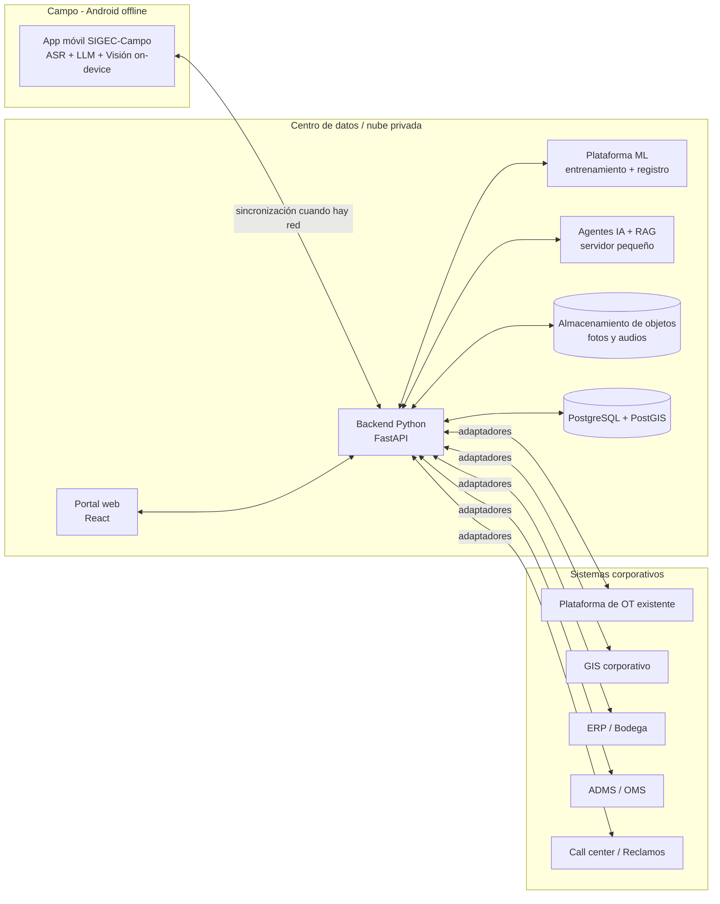
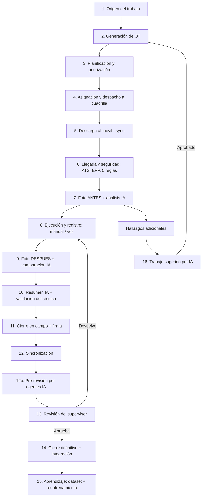
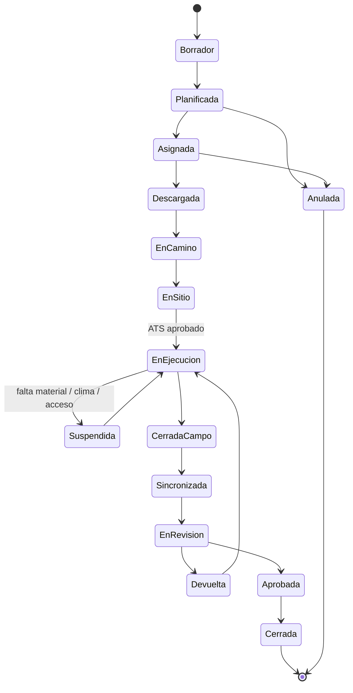
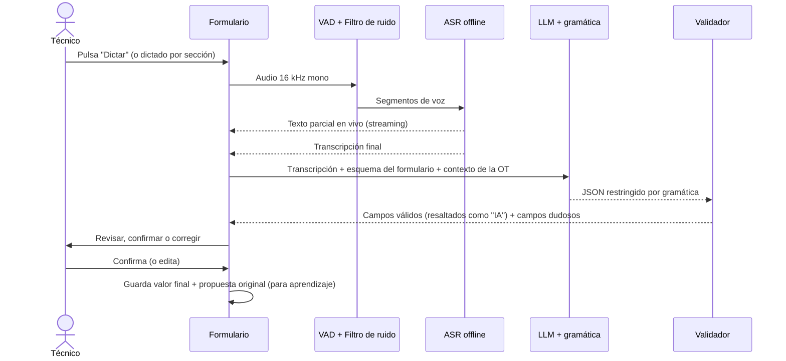
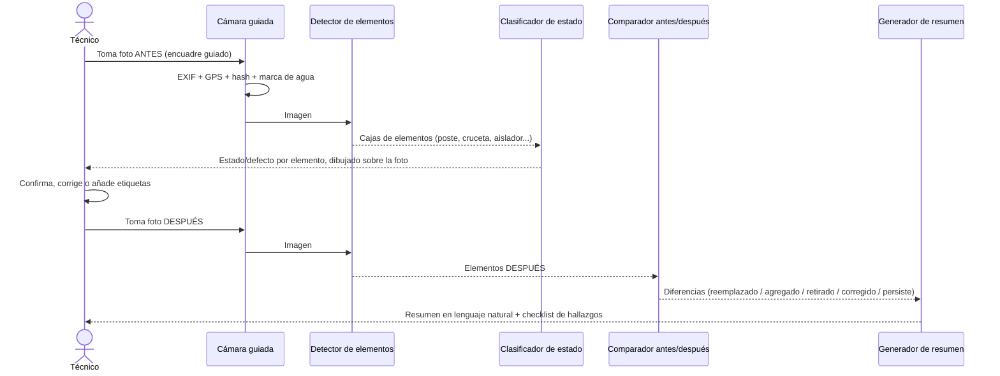
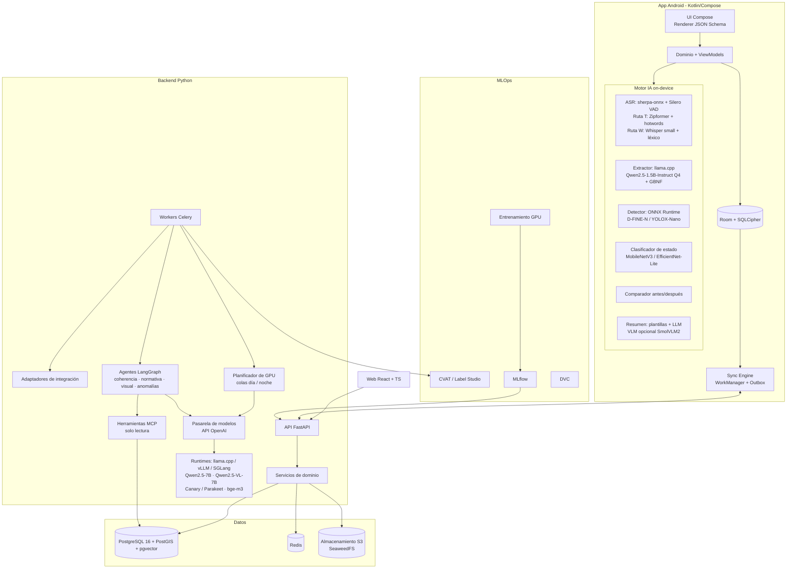
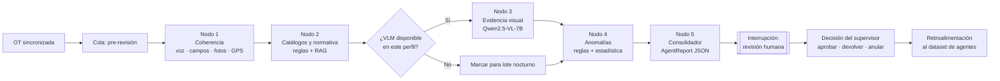

# Especificación de Requerimientos de Software (SRS)
# Plataforma **SIGEC-Campo**: Gestión Inteligente de Trabajos de Campo con Voz, Visión e IA Offline
### Empresa Eléctrica de Distribución — Ecuador

| Campo | Valor |
|---|---|
| Código del documento | SRS-SIGEC-CAMPO-001 |
| Versión | 1.1 (borrador para desarrollo) |
| Fecha | 19 de septiembre de 2026 |
| Estándar de referencia | ISO/IEC/IEEE 29148:2018 (adaptado) |
| Áreas usuarias | Operación de la Distribución · Mantenimiento · Alumbrado Público General (APG) · Ingeniería y Construcción |
| Destinatario técnico | Equipo de desarrollo (incluye agente de código **Claude Code**) |
| Documento complementario | `GUIA_ENTRENAMIENTO_MODELOS.md` (entrenamiento y aprendizaje continuo) |

> **Nota de nombre:** "SIGEC-Campo" es un nombre de trabajo. Se puede reemplazar globalmente.

### Historial de versiones
| Versión | Fecha | Cambios principales |
|---|---|---|
| 1.0 | 19-09-2026 | Versión inicial. |
| 1.1 | 19-09-2026 | **Capa de agentes de IA en el servidor** (módulo M17), **RAG normativo** (M18) y **servidor de modelos con planificador de GPU** (M19), dimensionados para servidor pequeño. ASR móvil con dos rutas (transductor con *hotwords* o Whisper con corrección por léxico). Re-transcripción del servidor con Canary/Parakeet. Detector principal D-FINE. Licencias de modelos CC-BY-4.0 y de datasets públicos. Nuevas entidades, endpoints, épica E10b, riesgos y decisiones. |

---

## Índice
0. Instrucciones para el agente de desarrollo (Claude Code)
1. Introducción
2. Descripción general del sistema
3. Macroproceso de extremo a extremo
4. Catálogo de formularios de campo por área
5. Requerimientos funcionales
6. Requerimientos no funcionales
7. Arquitectura técnica y stack open source
8. Modelo de datos
9. Especificación de API
10. Estructura del repositorio, plan de implementación y criterios de aceptación
11. Riesgos, supuestos y decisiones pendientes
- Anexo A. Ejemplo de esquema de formulario (JSON Schema + UI Schema)
- Anexo B. Taxonomía de visión (clases y estados)
- Anexo C. Matriz de criticidad para generación automática de trabajos
- Anexo D. Esquema del informe de agentes (`AgentReport`)
- Anexo E. Glosario

---

## 0. Instrucciones para el agente de desarrollo (Claude Code)

Esta sección está escrita para que un agente de código pueda construir el sistema de forma incremental y verificable.

1. **Fuente de verdad.** Este documento es la especificación. Cada requerimiento tiene un ID (`RF-xxx`, `RNF-xxx`). Referencia los IDs en los commits, los PR y los tests (por ejemplo: `test_rf_052_extraccion_json_valida`).
2. **Monorepo.** Crea la estructura de la sección 10.1 antes de escribir lógica. Incluye un `CLAUDE.md` raíz con comandos de build, test y lint de cada paquete.
3. **Orden de construcción.** Sigue las épicas de la sección 10.2 en orden. No inicies una épica sin que la anterior pase su *Definition of Done*.
4. **Formularios como datos, nunca como código.** Los formularios se definen en JSON Schema (draft 2020-12) + UI Schema, versionados en base de datos. La app web y la móvil los renderizan dinámicamente. Prohibido codificar un formulario específico en pantallas.
5. **La IA propone y el humano dispone.** Todo valor producido por IA (voz→campos, detecciones, resúmenes, trabajos sugeridos) se guarda con `origen = IA`, `modelo_version` y `confianza`, y requiere confirmación humana antes de marcarse como definitivo.
6. **Offline primero.** Toda funcionalidad móvil marcada como "Offline: Sí" debe probarse en modo avión.
7. **Licencias.** Solo se permiten dependencias con licencia MIT, BSD, Apache 2.0, MPL 2.0 o LGPL (enlazada dinámicamente). Las licencias AGPL o GPL en el binario distribuido **no están permitidas** sin aprobación explícita. Genera `THIRD_PARTY_LICENSES.md` automáticamente en CI. Esto excluye Ultralytics YOLO salvo que se adquiera su licencia Enterprise.
   - **Pesos de modelos:** además de las anteriores, se admite **CC-BY-4.0** (p. ej., NVIDIA Parakeet y Canary) con atribución en la pantalla "Acerca de" y en `THIRD_PARTY_LICENSES.md`. No se admiten licencias de investigación o no comerciales (p. ej., Qwen2.5-VL-3B y Qwen2.5-3B usan licencias propias de Qwen: evaluarlas antes de usarlas).
   - **Datasets:** los datasets con licencia no comercial (p. ej., InsPLAD, CC BY-NC) o de acceso restringido (IDID) solo se usan para **experimentos y benchmark del paper**, nunca para entrenar modelos desplegados. Evitar pesos preentrenados en Objects365 en los modelos de producción; usar pesos COCO.
8. **Modelos de IA desacoplados.** La app nunca depende de un modelo concreto. Usa interfaces (`SpeechRecognizer`, `FormExtractor`, `ObjectDetector`, `Summarizer`) con implementaciones intercambiables y un manifiesto de modelos descargable (sección 7.5).
9. **Modelos del servidor desacoplados.** El backend y los agentes consumen los LLM y VLM solo a través de una **pasarela compatible con la API de OpenAI** (M19). Cambiar de modelo o de runtime (llama.cpp, Ollama, vLLM, SGLang) no debe requerir cambios de código.
10. **Tests mínimos.** Backend ≥ 80 % de cobertura en dominio; móvil con pruebas unitarias de ViewModels y repositorios, y pruebas instrumentadas del flujo offline; web con pruebas de componentes y E2E (Playwright) de los flujos críticos.
11. **Agentes: asesoran, no deciden.** Ningún agente aprueba, cierra, anula ni envía órdenes a sistemas externos. Sus salidas son informes estructurados que un humano confirma (M17).
12. **Idioma.** Código, identificadores y comentarios en inglés. Textos de interfaz, catálogos y mensajes en español de Ecuador (i18n con archivos de recursos).

---

## 1. Introducción

### 1.1 Propósito
Definir los requerimientos de una plataforma que:
- **genera, planifica y despacha** trabajos de campo (órdenes de trabajo, OT) a funcionarios y cuadrillas;
- permite **ejecutar y registrar** esos trabajos desde un teléfono Android, **sin conexión**, mediante ingreso manual, **dictado por voz** que llena automáticamente los campos, y **fotografías** del estado inicial (antes) y final (después);
- **analiza las fotos en el teléfono**: identifica y señala todos los elementos de red visibles, su estado y los defectos, y compara el antes con el después;
- **resume** automáticamente lo encontrado y lo realizado;
- **valida y audita** en el servidor, mediante **agentes de IA open source**, la coherencia entre la voz, los datos, las fotos, los catálogos y la normativa, y pre-revisa las OT para el supervisor;
- ofrece un **asistente de procedimientos y normativa** (RAG) para técnicos y supervisores cuando hay conexión;
- **aprende** de las correcciones de los usuarios para mejorar continuamente sus modelos;
- **genera nuevos trabajos** (correctivos o preventivos) a partir de hallazgos, con aprobación humana;
- se **integra** con los sistemas corporativos: la plataforma de órdenes existente, el GIS, el ERP de materiales y el ADMS/OMS.

### 1.2 Alcance
**Dentro del alcance:** backend (Python), aplicación web (supervisores, planificadores, administradores), aplicación móvil Android (técnicos y cuadrillas), modelos de IA on-device y de servidor, **capa de agentes de validación y RAG normativo ejecutable en un servidor pequeño** (solo CPU o una GPU de 16–24 GB), pipeline de entrenamiento (MLOps), integraciones mediante adaptadores y reportería operativa.

**Fuera del alcance (v1):** app iOS, facturación y comercialización (cortes y reconexiones comerciales se consideran en v2 como extensión del catálogo), control en tiempo real de la red (SCADA) y gestión contable de activos.

### 1.3 Áreas y actividades cubiertas
| Área | Actividades típicas |
|---|---|
| **Operación de la Distribución** | Atención de fallas y reclamos técnicos, maniobras, consignaciones y descargos, registro de interrupciones, reposición del servicio, inspección de alimentadores, verificación de la calidad del producto (voltaje). |
| **Mantenimiento** | Inspección preventiva de redes de MV y BV, mantenimiento de transformadores y de equipos de seccionamiento y protección, poda y despeje de franja, cambio de postes y estructuras, termografía, puestas a tierra. |
| **Alumbrado Público General (APG)** | Atención de luminarias en falla, mantenimiento preventivo, censo e inventario de luminarias, mediciones fotométricas, reemplazo y modernización (LED). |
| **Ingeniería y Construcción** | Inspección de factibilidad, levantamiento para diseño, replanteo, avance de obra (bitácora), fiscalización, recepción de obra, actualización de catastro GIS (as-built) y liquidación de materiales y Unidades de Construcción. |
| **Transversal (SSO)** | Análisis de Trabajo Seguro (ATS), permiso de trabajo, aplicación de las 5 reglas de oro, checklist de EPP y herramientas, reporte de incidentes. |

### 1.4 Referencias normativas y técnicas
| Ref. | Documento | Uso en el sistema |
|---|---|---|
| N1 | Homologación de las Unidades de Propiedad (UP) y Unidades de Construcción (UC) del Sistema de Distribución Eléctrica (MEER y empresas distribuidoras) | Catálogo maestro de activos y estructuras; códigos nemotécnicos por grupo (ES estructuras, TR transformadores, SP seccionamiento y protección, EC compensación, PO postes, CO conductores, ME medidores, AC acometidas, TA tensores y anclajes, AP alumbrado, etc.). Base de las clases de visión y de los campos de materiales. |
| N2 | Regulación ARCERNNR-002/20 "Calidad del Servicio de Distribución y Comercialización de Energía Eléctrica" | Campos obligatorios para el registro de interrupciones (inicio, fin, causa, kVA afectados, alimentador) que alimentan los índices FMIK y TTIK. |
| N3 | Regulación ARCERNNR-007/23 "Marco normativo para la prestación del servicio de Alumbrado Público General" (sustituye a la 006/20) | Definición de luminaria en falla, tiempos máximos de reposición (parametrizables), inventario de activos de APG y mediciones fotométricas. |
| N4 | Reglamento de Seguridad del Trabajo contra Riesgos en Instalaciones de Energía Eléctrica (Acuerdo Ministerial 013, 1998) | Formularios de ATS, permiso de trabajo, EPP y 5 reglas de oro. |
| N5 | Ley Orgánica de Protección de Datos Personales (LOPDP, 2021) y su reglamento | Tratamiento de voz, fotos, ubicación y datos de clientes. |
| N6 | IEC 61968 / 61970 (CIM) | Modelo de intercambio con ADMS, OMS y MWM. |
| N7 | Normativa interna de la distribuidora (manuales de construcción, procedimientos) | Se carga como catálogos y reglas configurables. |

> **Importante:** los valores numéricos regulatorios (tiempos máximos de reposición de APG, límites FMIK/TTIK, etc.) **no se codifican**. Se parametrizan en la tabla `regulatory_parameter` con vigencia y referencia a la norma, porque cambian con cada regulación.

### 1.5 Definiciones clave
- **OT:** Orden de Trabajo.
- **Cuadrilla:** grupo de funcionarios que ejecuta una OT; tiene un jefe de cuadrilla.
- **Hallazgo:** condición anómala detectada (por un humano o por IA) sobre un activo.
- **Evidencia:** foto, audio o documento asociado a una OT, con metadatos de integridad.
- **Paquete de modelos:** conjunto versionado de modelos de IA (ASR, LLM, detector, clasificador, VLM) que usa la app.
- **Propuesta IA:** valor sugerido por un modelo, pendiente de confirmación humana.

---

## 2. Descripción general del sistema

### 2.1 Contexto


### 2.2 Actores y roles
| Rol | Descripción | Canal |
|---|---|---|
| **Técnico / Liniero** | Ejecuta el trabajo, captura datos, voz y fotos | Móvil |
| **Jefe de cuadrilla** | Recibe y reparte OT, firma ATS, cierra OT en campo | Móvil (y web lectura) |
| **Inspector / Fiscalizador** | Realiza inspecciones y fiscalización de obras | Móvil + Web |
| **Supervisor de área** | Revisa y aprueba registros, valida propuestas IA, aprueba trabajos sugeridos | Web (y móvil) |
| **Planificador / Despachador** | Crea, prioriza, programa y asigna OT | Web |
| **Operador de centro de control** | Genera OT de operación desde el OMS y registra maniobras | Web |
| **Ingeniero de diseño** | Consume levantamientos y actualiza diseños y GIS | Web |
| **Analista de datos / ML** | Etiqueta, entrena, evalúa y publica modelos; mantiene los agentes y la base de conocimiento | Web (módulo ML) |
| **Agentes de IA** (actor de sistema) | Pre-revisan, auditan, sugieren prioridades y responden consultas; nunca aprueban ni cierran | Backend |
| **Administrador funcional** | Gestiona formularios, catálogos, reglas y parámetros | Web |
| **Administrador de TI** | Usuarios, dispositivos, integraciones, seguridad | Web |
| **Auditor** | Consulta de solo lectura con trazabilidad completa | Web |

### 2.3 Restricciones de diseño
- **R1:** Backend en **Python ≥ 3.12**.
- **R2:** Frontend **web** (navegadores de escritorio y tablet).
- **R3:** Móvil **Android nativo** (minSdk 29 / Android 10; targetSdk el vigente en Google Play).
- **R4:** Componentes **open source** con licencias permisivas (ver 0.7).
- **R5:** El análisis de voz e imagen debe funcionar **100 % offline** en el teléfono. El servidor puede **reprocesar con modelos más grandes y auditar con agentes** cuando hay conexión (modo híbrido), pero nunca es requisito para cerrar una OT en campo.
- **R6:** Hardware objetivo: Android de gama media. Mínimo 8 GB de RAM (recomendado 12 GB), SoC de clase Snapdragon 7 / Dimensity 7000-8000 o superior, 128 GB de almacenamiento (recomendado 256 GB), batería ≥ 5000 mAh, IP68 y MIL-STD-810H.
- **R7:** Despliegue on-premise o en nube privada, con contenedores (Docker/Kubernetes).
- **R8:** La capa de IA del servidor debe funcionar en **tres perfiles de hardware** (sección 7.9): A) solo CPU (el servidor actual), B) una GPU de 16 GB y C) una GPU de 24 GB. Las funciones que no quepan en un perfil se degradan a **procesamiento por lotes nocturno**, nunca se bloquean.

---

## 3. Macroproceso de extremo a extremo

### 3.1 Vista general


### 3.2 Descripción de cada etapa
| # | Etapa | Descripción | Actor | Canal | Offline |
|---|---|---|---|---|---|
| 1 | **Origen** | Reclamo del cliente (call center), evento del OMS/ADMS, plan de mantenimiento preventivo, hallazgo de una inspección, solicitud de APG, proyecto de ingeniería o trabajo sugerido por IA. | Sistema / usuarios | Web / integraciones | — |
| 2 | **Generación de OT** | Se crea la OT con tipo, activo o ubicación, prioridad, formulario asociado y SLA. Puede crearse manualmente, por integración o por regla automática. | Planificador / sistema | Web | — |
| 3 | **Planificación** | Priorización por criticidad y SLA, agrupación geográfica, estimación de tiempos y materiales, y verificación de consignaciones requeridas. | Planificador | Web | — |
| 4 | **Asignación y despacho** | Asignación a cuadrilla o funcionario según zona, competencias, disponibilidad y carga. Notificación al móvil. | Despachador | Web | — |
| 5 | **Descarga** | El móvil descarga OT, formularios, catálogos, capas de mapa de la zona, historial del activo y el paquete de modelos vigente. | Técnico | Móvil | Tras descargar |
| 6 | **Seguridad** | ATS obligatorio, checklist de EPP y herramientas, y confirmación de las 5 reglas de oro cuando aplica. **Bloqueante**: sin ATS no se habilita el registro de ejecución. | Jefe de cuadrilla | Móvil | Sí |
| 7 | **Foto ANTES** | Fotos guiadas (encuadres requeridos por tipo de OT). El detector marca **todos los elementos visibles**, su estado y los defectos, y pre-llena la sección "Estado encontrado". | Técnico | Móvil | Sí |
| 8 | **Ejecución** | El técnico registra actividades, materiales, mediciones y tiempos por **ingreso manual**, **dictado por voz** (el LLM llena los campos) o una mezcla de ambos. | Técnico | Móvil | Sí |
| 9 | **Foto DESPUÉS** | Fotos del resultado. La IA compara con el ANTES: elementos reemplazados, agregados, retirados y defectos corregidos o persistentes. | Técnico | Móvil | Sí |
| 10 | **Resumen y validación** | La IA genera el resumen "Encontrado / Realizado / Pendiente". El técnico revisa **cada campo propuesto** (resaltado) y lo confirma o corrige. | Técnico | Móvil | Sí |
| 11 | **Cierre en campo** | Validaciones obligatorias, firma del jefe de cuadrilla (y del cliente si aplica), sello de tiempo y GPS. | Jefe de cuadrilla | Móvil | Sí |
| 12 | **Sincronización** | Cola de envío con reintentos: datos, luego miniaturas, luego fotos completas y audios (según la política de red). | Sistema | Móvil → API | Diferida |
| 12b | **Pre-revisión por agentes** | En el servidor, los agentes verifican la coherencia (voz ↔ campos ↔ fotos), el cumplimiento de catálogos y normativa (RAG), la calidad de la evidencia (VLM) y posibles anomalías; asignan un **nivel de riesgo** y listan las observaciones con su fuente. Las OT de bajo riesgo pueden aprobarse en lote por el supervisor. | Agentes IA | Servidor | — |
| 13 | **Revisión** | El supervisor revisa, compara el antes y el después, consulta el informe de los agentes, valida las propuestas IA y aprueba o devuelve con observaciones. | Supervisor | Web | — |
| 14 | **Cierre definitivo** | Se actualizan la plataforma de OT existente, el GIS (as-built), el ERP (materiales) y el OMS (interrupción). Se calculan los KPI. | Sistema | — | — |
| 15 | **Aprendizaje** | Cada corrección humana se almacena como etiqueta. Los datos pasan a la curaduría, el reentrenamiento, la evaluación y la publicación de un nuevo paquete de modelos. | Analista ML | Web ML | — |
| 16 | **Trabajo sugerido** | Hallazgos no resueltos (por ejemplo, un aislador roto en un poste vecino) generan **OT propuestas** con prioridad calculada (Anexo C). Requieren aprobación. | IA + Supervisor | Móvil/Web | Propuesta offline |

### 3.3 Estados de la OT

Cada transición registra usuario, fecha/hora del dispositivo y del servidor, GPS y motivo (obligatorio en Suspendida, Devuelta y Anulada).

### 3.4 Flujo detallado de captura por voz (en el teléfono)


### 3.5 Flujo detallado de análisis de imagen


---

## 4. Catálogo de formularios de campo por área

### 4.1 Principios de diseño de formularios
1. **Bloques reutilizables.** Cada formulario se compone de bloques estándar (cabecera, ubicación, seguridad, estado encontrado, actividades, materiales, mediciones, evidencias, resumen, cierre y firmas) más un bloque específico del tipo de trabajo.
2. **Catálogos homologados.** Los campos de activos y materiales usan el catálogo de **Unidades de Propiedad y Unidades de Construcción** (N1) y los códigos de materiales del ERP, nunca texto libre.
3. **Voz habilitada por campo.** Cada campo declara `x-voice: true|false` y sinónimos (`x-synonyms`) para ayudar al extractor. Ejemplo: "fusible", "tirafusible" y "hilo fusible" se asocian al mismo campo.
4. **IA visual por campo.** Los campos que pueden pre-llenarse desde una foto declaran `x-vision-source` (por ejemplo, `material_poste ← clase detectada`).
5. **Validaciones de negocio** con JSON Schema: rangos, formatos, dependencias y reglas condicionales (`if/then`).
6. **Versionado.** Una OT siempre se ejecuta con la versión del formulario vigente al asignarse.

Leyenda de las tablas: **Obl.** obligatorio · **Voz** llenable por dictado · **IA-F** pre-llenable desde foto · **Tipo** (`txt` texto, `num` número, `cat` catálogo, `mcat` catálogo múltiple, `bool` sí/no, `fh` fecha-hora, `geo` punto GPS, `foto`, `firma`, `tabla` filas repetibles).

### 4.2 Bloques comunes (en todos los formularios)
| Bloque | Campos | Tipo | Obl. | Voz | IA-F |
|---|---|---|---|---|---|
| **B1 Cabecera** | N.º OT, tipo de trabajo, prioridad, cuadrilla, integrantes, vehículo | auto/cat | Sí | No | No |
| **B2 Ubicación** | Coordenadas GPS (precisión en m), provincia, cantón, parroquia, dirección o referencia, subestación, alimentador, código del activo (poste/transformador/luminaria), N.º de suministro o medidor | geo/cat/txt | Sí (GPS) | Sí (dirección, referencia) | Placa del poste/activo por OCR (v2) |
| **B3 Tiempos** | Hora de despacho, salida, llegada, inicio, fin; motivos de demora | fh | Sí | Sí ("llegamos a las diez y cuarto") | No |
| **B4 Seguridad** | Referencia al ATS y al permiso de trabajo; confirmación de EPP | ref | Sí | No | EPP visible (v2) |
| **B5 Estado encontrado** | Descripción, elementos observados, defectos (múltiples), condición general (Bueno / Regular / Malo / Crítico) | txt/mcat | Sí | **Sí** | **Sí** |
| **B6 Actividades realizadas** | Tabla: actividad (catálogo), cantidad, unidad, observación | tabla | Sí | **Sí** | No |
| **B7 Materiales** | Tabla: código de material o UC, descripción, cantidad instalada, cantidad retirada, estado del retirado (reutilizable / chatarra), N.º de serie si aplica | tabla | Cond. | **Sí** | Parcial |
| **B8 Mediciones** | Según el tipo (voltajes, corrientes, resistencia de puesta a tierra, lux, temperatura) | num | Cond. | **Sí** | No |
| **B9 Evidencias** | Fotos ANTES (mín. según tipo), fotos DESPUÉS, croquis y audio | foto | Sí | No | — |
| **B10 Resumen** | Encontrado / Realizado / Pendiente (texto generado por IA y editable) | txt | Sí | IA | **Sí** |
| **B11 Hallazgos adicionales** | Tabla: activo, defecto, criticidad, foto, "¿generar trabajo?" | tabla | No | **Sí** | **Sí** |
| **B12 Cierre** | Estado final (Resuelto / Parcial / No resuelto), causa de no resolución, firma del jefe de cuadrilla, firma o cédula del cliente (si aplica) | cat/firma | Sí | Sí (estado) | No |

### 4.3 Transversales de Seguridad y Salud Ocupacional (SSO)

#### F-TR-01 Análisis de Trabajo Seguro (ATS)
| Campo | Tipo | Obl. | Voz |
|---|---|---|---|
| Descripción de la tarea | txt | Sí | Sí |
| Tipo de trabajo (sin tensión / con tensión / en proximidad) | cat | Sí | Sí |
| Nivel de voltaje (BV / MV, kV) | cat | Sí | Sí |
| Peligros identificados (eléctrico, altura, tránsito vehicular, clima, animales, vegetación, espacio confinado, terceros) | mcat | Sí | Sí |
| Medidas de control por peligro | tabla | Sí | Sí |
| Condiciones climáticas (lluvia, tormenta eléctrica, viento) | cat | Sí | Sí |
| Señalización y delimitación del área | bool + foto | Sí | No |
| Integrantes, con firma de cada uno | tabla/firma | Sí | No |
| **Regla:** tormenta eléctrica = Sí → bloquea el inicio y exige autorización del supervisor | — | — | — |

#### F-TR-02 Permiso de trabajo y 5 reglas de oro (consignación)
| Campo | Tipo | Obl. | Voz |
|---|---|---|---|
| N.º de consignación o descargo otorgado por el Centro de Control | txt | Sí | Sí |
| Equipo o tramo consignado | cat/txt | Sí | Sí |
| 1) Corte efectivo de todas las fuentes (hora, equipo operado) | fh/txt | Sí | Sí |
| 2) Bloqueo y señalización (tarjeta, candado) | bool + foto | Sí | No |
| 3) Verificación de ausencia de tensión (detector usado) | bool + foto | Sí | Sí |
| 4) Puesta a tierra y en cortocircuito (ubicación) | bool + foto | Sí | Sí |
| 5) Delimitación y señalización de la zona de trabajo | bool + foto | Sí | No |
| Hora de devolución de la consignación, responsable | fh/txt | Sí | Sí |

#### F-TR-03 Checklist de EPP y herramientas
Casco dieléctrico, gafas, guantes dieléctricos (clase y fecha de ensayo), mangas, arnés y línea de vida, calzado dieléctrico, ropa ignífuga, pértigas (fecha de ensayo), detector de tensión, equipos de puesta a tierra temporal, escaleras y conos. Cada ítem: `bool` + observación. Alerta automática si la fecha de ensayo está vencida.

#### F-TR-04 Reporte de incidente o cuasi accidente
Fecha, hora y lugar; tipo (accidente, incidente, cuasi accidente, daño a terceros); personas involucradas; descripción (**voz**); causas inmediatas; acciones inmediatas; fotos. Notificación inmediata a SSO al sincronizar.

### 4.4 Operación de la Distribución

#### F-OP-01 Atención de falla o reclamo técnico
| Campo | Tipo | Obl. | Voz | IA-F |
|---|---|---|---|---|
| N.º de reclamo o evento del OMS | txt | Sí | No | No |
| Tipo de reclamo (sin servicio total, parcial, bajo voltaje, variaciones, poste en riesgo, cable caído, chispas o ruido en transformador, otros) | cat | Sí | Sí | No |
| Nivel afectado (acometida, red BV, transformador, ramal MV, troncal MV) | cat | Sí | Sí | Parcial |
| Elemento fallado (según UP: fusible, seccionador, conductor, aislador, pararrayos, transformador, empalme, conector, acometida, medidor) | cat | Sí | **Sí** | **Sí** |
| Causa de la falla (vegetación, animal, descarga atmosférica, choque vehicular, sobrecarga, falla de material, vandalismo o hurto, terceros, desconocida) | cat | Sí | **Sí** | Parcial |
| Clientes afectados (estimado) | num | No | Sí | No |
| Acción correctiva (reemplazo de fusible, reconexión, empalme, cambio de elemento, maniobra) | mcat | Sí | **Sí** | No |
| Capacidad y tipo del tirafusible instalado (p. ej., 6K, 10K, 15T) | cat | Cond. | **Sí** | No |
| Mediciones posteriores: voltaje fase-neutro y fase-fase en BV | num | Cond. | **Sí** | No |
| Servicio restablecido (Sí / No / Parcial) y hora | cat/fh | Sí | **Sí** | No |
| Requiere trabajo adicional (genera OT sugerida) | bool | Sí | Sí | Sí |

#### F-OP-02 Maniobra
Equipo maniobrado (código), tipo de equipo (seccionador, reconectador, interruptor, barra), operación (apertura / cierre / transferencia), hora exacta, ordenada por (operador del Centro de Control), número de orden de maniobra, estado previo y posterior, observaciones (**voz**) y foto del equipo en la posición final.

#### F-OP-03 Registro de interrupción (soporte para FMIK y TTIK, ARCERNNR-002/20)
| Campo | Tipo | Obl. | Voz |
|---|---|---|---|
| Alimentador y subestación | cat | Sí | Sí |
| Tipo de interrupción (programada / no programada) | cat | Sí | Sí |
| Origen (interna de la distribuidora / externa: transmisor o generación) | cat | Sí | Sí |
| Fecha y hora de inicio y de fin (reposición total) | fh | Sí | Sí |
| Reposiciones parciales (tabla: hora, tramo, kVA repuestos) | tabla | Cond. | Sí |
| Equipo de protección que operó | cat | Sí | Sí |
| Transformadores o kVA afectados (se autocalcula desde el GIS si hay topología) | num | Sí | No |
| Causa (catálogo regulatorio configurable) | cat | Sí | **Sí** |
| **Regla:** duración < umbral parametrizado → se marca como "no computable" (el umbral viene de `regulatory_parameter`). | — | — | — |

#### F-OP-04 Inspección de alimentador (recorrido)
Tramo inicial y final, fecha, recorrido GPS (track automático), y una tabla de **hallazgos por vano o estructura** con código de estructura, defecto (catálogo), criticidad, foto con detección IA y "generar OT". Pensado para dictado continuo: *"poste cuatro cinco dos, cruceta podrida lado izquierdo, prioridad alta"* crea una fila.

#### F-OP-05 Verificación de calidad del producto (voltaje)
Medidor o suministro, equipo registrador instalado (marca, serie), fechas de instalación y retiro, lecturas puntuales (V, A, factor de potencia), resultado, fotos de la instalación del registrador.

### 4.5 Mantenimiento

#### F-MT-01 Inspección preventiva de estructura o poste (red aérea MV/BV)
| Campo | Tipo | Obl. | Voz | IA-F |
|---|---|---|---|---|
| Código de poste o estructura (UP/UC, p. ej., grupo ES/PO) | cat | Sí | Sí | OCR placa (v2) |
| Material del poste (hormigón, madera, metálico, fibra) y altura | cat/num | Sí | Sí | **Sí** |
| Estado del poste (bueno, fisurado, inclinado, base erosionada, oxidado, podrido) | mcat | Sí | **Sí** | **Sí** |
| Cruceta (material, estado: buena, torcida, podrida, rota) | cat | Cond. | **Sí** | **Sí** |
| Aisladores (tipo: pin, suspensión, retenida; estado: bueno, flameado, roto, contaminado) | mcat | Cond. | **Sí** | **Sí** |
| Conductores (flojos, deshilachados, empalmes defectuosos, distancia de seguridad) | mcat | Cond. | **Sí** | **Sí** |
| Tensor o retenida (estado, protector) | cat | Cond. | **Sí** | **Sí** |
| Puesta a tierra (existe, conectada, resistencia medida en Ω) | bool/num | Cond. | **Sí** | Parcial |
| Pararrayos y seccionador fusible (estado, fusible operado) | cat | Cond. | **Sí** | **Sí** |
| Vegetación (distancia estimada, contacto sí/no) | cat | Sí | **Sí** | **Sí** |
| Nidos, objetos extraños, publicidad o cables de terceros | mcat | No | **Sí** | **Sí** |
| Criticidad global (calculada, Anexo C) | auto | Sí | No | Sí |

#### F-MT-02 Mantenimiento de transformador de distribución
N.º de serie y código, potencia (kVA), fases (mono/trifásico/banco), voltajes primario y secundario, tipo de montaje (poste, cabina, pedestal, *pad-mounted*), estado del tanque (fugas de aceite, corrosión), bushings, conexiones, pararrayos, puesta a tierra (Ω), mediciones de carga por fase (A), voltajes en BV, temperatura (termografía, si aplica), nivel de aceite, acciones (limpieza, ajuste, cambio de bushing, reemplazo del transformador), serie del transformador retirado e instalado. **IA-F:** tipo de montaje, fugas visibles, corrosión, pararrayos.

#### F-MT-03 Poda y despeje de franja de servidumbre
Tramo o vanos, especie (si se conoce), tipo de intervención (poda, tala, desbroce), cantidad (árboles o metros), distancia a la red antes y después, permiso ambiental o municipal (si aplica), gestión de residuos, fotos antes y después. **IA-F:** vegetación en contacto o cercana (antes vs. después).

#### F-MT-04 Mantenimiento de equipo de seccionamiento y protección
Tipo (seccionador fusible, seccionador de barra, reconectador, seccionalizador), código, estado de contactos, operación mecánica, calibración y ajustes (reconectador: curvas, número de operaciones del contador), cambio de elementos, pruebas realizadas, fotos.

#### F-MT-05 Cambio de poste o estructura
Poste retirado (material, altura, estado) y poste instalado (UP/UC), estructuras transferidas (tabla), materiales, consignación asociada, tiempo de corte, fotos obligatorias: antes, durante y después. **IA-F:** comparación entre poste retirado e instalado.

#### F-MT-06 Termografía
Equipo o conexión inspeccionada, temperatura máxima, temperatura de referencia, ΔT, carga al momento (%), clasificación de severidad (configurable), imagen térmica y visible. (La imagen térmica se adjunta; la IA solo analiza la imagen visible.)

#### F-MT-07 Medición de puesta a tierra
Ubicación, método (caída de potencial / pinza), equipo y fecha de calibración, resistencia medida (Ω), valor máximo admisible (parámetro), cumple sí/no (auto), acción correctiva.

### 4.6 Alumbrado Público General (ARCERNNR-007/23)

#### F-AP-01 Atención de luminaria en falla
| Campo | Tipo | Obl. | Voz | IA-F |
|---|---|---|---|---|
| N.º de reclamo y fecha-hora del reclamo | txt/fh | Sí | No | No |
| Código de luminaria o poste | cat | Sí | Sí | OCR (v2) |
| Tipo de falla reportada (apagada de noche, encendida de día, intermitente, dañada físicamente) | cat | Sí | **Sí** | Parcial |
| Tecnología (LED, sodio alta presión, mercurio, metal halide, otra) y potencia (W) | cat/num | Sí | **Sí** | **Sí** (tecnología) |
| Causa encontrada (lámpara o módulo LED, driver o balasto, fotocontrol, fusible, conexión, brazo, vandalismo, alimentación) | cat | Sí | **Sí** | Parcial |
| Elementos reemplazados (tabla con material y cantidad) | tabla | Cond. | **Sí** | No |
| Luminaria operativa al finalizar (prueba con fotocontrol tapado) | bool | Sí | **Sí** | **Sí** (encendida en la foto después) |
| Tiempo de reposición (auto: cierre − reclamo) vs. máximo regulatorio (parámetro) | auto | Sí | No | No |

#### F-AP-02 Censo e inventario de APG
Por punto de luz: código, GPS, poste (material, altura), tipo de brazo, tecnología y potencia, tipo de vía, circuito o transformador que lo alimenta, tipo de control (fotocontrol individual / circuito controlado / telegestión), estado y foto. Pensado para **dictado en lote**: *"luminaria LED de cien vatios, brazo de uno punto cinco metros, poste de hormigón de doce metros, buen estado"*.

#### F-AP-03 Medición fotométrica
Vía (tipo y clase de iluminación), malla de medición (tabla de puntos con lux), luxómetro (serie, calibración), iluminancia media y uniformidad (autocalculadas), cumple sí/no según el parámetro de la clase, condiciones (humedad, obstrucciones) y fotos.

#### F-AP-04 Instalación, reemplazo o modernización de luminaria
Luminaria retirada (tecnología, potencia, estado, destino) e instalada (marca, modelo, potencia, serie), brazo, fotocontrol o nodo de telegestión, prueba de encendido, fotos antes y después. **IA-F:** tecnología antes (p. ej., sodio) vs. después (LED).

### 4.7 Ingeniería y Construcción

#### F-IC-01 Inspección de factibilidad o levantamiento para diseño
Solicitante o proyecto, punto de conexión propuesto (GIS), red existente cercana (tipo, fases, voltaje, distancia), transformador más cercano (kVA, carga estimada), levantamiento de postes y estructuras existentes (tabla), obstáculos (vías, ríos, vegetación, predios), croquis, fotos panorámicas y de detalle, recomendación técnica (**voz**). **IA-F:** inventario automático de elementos visibles para acelerar el levantamiento.

#### F-IC-02 Replanteo
Proyecto y diseño aprobado (versión), puntos replanteados (tabla con GPS: poste proyectado, desplazamiento vs. diseño, motivo), cambios propuestos, firma del fiscalizador.

#### F-IC-03 Avance de obra (bitácora diaria)
Proyecto, contratista, frente de trabajo, personal y equipo presentes, actividades del día por UC (tabla con cantidad ejecutada), porcentaje de avance, novedades (clima, permisos, conflictos), materiales recibidos y usados, fotos georreferenciadas. **Voz:** dictado de la bitácora completa con extracción a tabla de UC.

#### F-IC-04 Fiscalización y recepción de obra
Checklist por UC (según el Manual de Unidades de Construcción, N1): cumplimiento de especificación, verticalidad de postes, flechas y tensado, distancias de seguridad, puesta a tierra (Ω), numeración y señalética, limpieza; observaciones y no conformidades (tabla con plazo), resultado (Recibida / Recibida con observaciones / No recibida), acta y firmas. **IA-F:** verificación visual de elementos instalados vs. diseño (lista de UC esperadas vs. detectadas).

#### F-IC-05 Actualización de catastro GIS (as-built)
Por elemento: tipo (UP), código, GPS de precisión (con precisión reportada), atributos, conectividad (elemento padre, fase), foto y acción (nuevo / modificado / retirado). Exporta a GeoJSON y al conector GIS.

#### F-IC-06 Liquidación de materiales y UC
Proyecto u OT, tabla de UC ejecutadas vs. presupuestadas, materiales entregados, instalados, devueltos y en chatarra, diferencias con justificación y firma de bodega y fiscalización.

### 4.8 Resumen de formularios v1
| Código | Formulario | Área | Fotos mín. (antes / después) | Voz | IA visual |
|---|---|---|---|---|---|
| F-TR-01 | ATS | SSO | 1 / 0 | Sí | No |
| F-TR-02 | Permiso y 5 reglas de oro | SSO | 3 / 0 | Sí | No |
| F-TR-03 | Checklist EPP | SSO | 0 / 0 | No | v2 |
| F-TR-04 | Incidente | SSO | 1 / 0 | Sí | No |
| F-OP-01 | Atención de falla o reclamo | Operación | 2 / 2 | Sí | Sí |
| F-OP-02 | Maniobra | Operación | 0 / 1 | Sí | No |
| F-OP-03 | Registro de interrupción | Operación | 0 / 0 | Sí | No |
| F-OP-04 | Inspección de alimentador | Operación | 1 por hallazgo | Sí | Sí |
| F-OP-05 | Calidad de producto | Operación | 1 / 1 | Sí | No |
| F-MT-01 | Inspección de estructura | Mantenimiento | 2 / 0 | Sí | Sí |
| F-MT-02 | Transformador | Mantenimiento | 2 / 2 | Sí | Sí |
| F-MT-03 | Poda y despeje | Mantenimiento | 2 / 2 | Sí | Sí |
| F-MT-04 | Seccionamiento y protección | Mantenimiento | 1 / 1 | Sí | Sí |
| F-MT-05 | Cambio de poste | Mantenimiento | 2 / 2 | Sí | Sí |
| F-MT-06 | Termografía | Mantenimiento | 2 / 0 | Sí | Parcial |
| F-MT-07 | Puesta a tierra | Mantenimiento | 1 / 0 | Sí | No |
| F-AP-01 | Luminaria en falla | APG | 1 / 1 | Sí | Sí |
| F-AP-02 | Censo APG | APG | 1 / 0 | Sí | Sí |
| F-AP-03 | Fotometría | APG | 1 / 0 | Sí | No |
| F-AP-04 | Reemplazo de luminaria | APG | 1 / 1 | Sí | Sí |
| F-IC-01 | Factibilidad o levantamiento | Ing. y Constr. | 3 / 0 | Sí | Sí |
| F-IC-02 | Replanteo | Ing. y Constr. | 1 / 0 | Sí | No |
| F-IC-03 | Bitácora de obra | Ing. y Constr. | 2 / 0 | Sí | Parcial |
| F-IC-04 | Fiscalización y recepción | Ing. y Constr. | 0 / 3 | Sí | Sí |
| F-IC-05 | As-built GIS | Ing. y Constr. | 1 por elemento | Sí | Sí |
| F-IC-06 | Liquidación de materiales | Ing. y Constr. | 0 / 0 | Sí | No |

> Los formularios anteriores son una **línea base** construida desde la normativa ecuatoriana y la práctica del sector. Antes de la épica E3, cada área debe validarlos contra sus formatos vigentes (papel o Excel). El diseñador de formularios (M04) permite ajustarlos sin programar.

---

## 5. Requerimientos funcionales

Prioridad MoSCoW: **M** = Must (MVP), **S** = Should, **C** = Could, **W** = Won't (v1). Canal: W = web, A = Android, B = backend.

### M01 — Identidad, roles y dispositivos
| ID | Requerimiento | Prio | Canal | Criterio de aceptación |
|---|---|---|---|---|
| RF-001 | Autenticación OIDC (Keycloak) con usuario corporativo (integración LDAP/AD). | M | W/A/B | El login web y móvil usa el mismo IdP; tokens JWT con expiración configurable. |
| RF-002 | Control de acceso por roles (sección 2.2) y por **ámbito** (área, zona, agencia, contratista). | M | B | Un supervisor de APG de la zona Norte no ve OT de Mantenimiento de la zona Sur (test de autorización). |
| RF-003 | Sesión offline en el móvil: tras un login en línea, permite trabajar hasta N días sin red (parámetro, por defecto 7) con PIN o biometría. | M | A | En modo avión, tras reiniciar el teléfono, el usuario entra con PIN o huella y ve sus OT. |
| RF-004 | Registro y enrolamiento de dispositivos (ID, modelo, versión de la app, versión del paquete de modelos, último sync). Bloqueo y borrado remoto de datos de la app. | M | W/B | El admin bloquea un dispositivo y en el siguiente sync la app se cierra y borra la base local cifrada. |
| RF-005 | Gestión de cuadrillas: integrantes, jefe, vehículo, competencias (MV, BV, trabajo en tensión, APG, altura) y zona. | M | W | Crear, editar y desactivar cuadrillas; historial de cambios. |

### M02 — Gestión y generación de órdenes de trabajo
| ID | Requerimiento | Prio | Canal | Criterio de aceptación |
|---|---|---|---|---|
| RF-010 | Crear OT manualmente con: tipo, área, formulario, activo o ubicación (mapa), prioridad, SLA, descripción, adjuntos, materiales estimados. | M | W | La OT creada queda en estado Borrador o Planificada con código único secuencial por área y año. |
| RF-011 | Crear OT automáticamente desde **integraciones**: reclamos del call center, eventos del OMS/ADMS y la plataforma de OT existente. | M | B | Un evento entrante crea la OT con idempotencia (el mismo ID externo no duplica). |
| RF-012 | Crear OT desde **planes de mantenimiento preventivo** (por activo, frecuencia, ruta o alimentador). | S | W/B | Un plan mensual genera N OT en la fecha programada (job programado). |
| RF-013 | **Trabajos sugeridos por IA**: a partir de hallazgos (B11 o detección visual) se crea una *OT propuesta* con tipo, prioridad (Anexo C), activo, fotos y justificación. | M | A/W/B | La propuesta aparece en la bandeja del supervisor; al aprobarla pasa a Planificada; al rechazarla guarda el motivo (etiqueta de aprendizaje). |
| RF-014 | Deduplicación de hallazgos y OT: alerta si existe una OT abierta sobre el mismo activo o a menos de X m con el mismo tipo de defecto. | S | B | Dos hallazgos del mismo poste y defecto en 30 días se agrupan. |
| RF-015 | OT multi-actividad y OT hijas (p. ej., una obra con múltiples frentes). | S | W | Una OT padre muestra el avance agregado de sus hijas. |
| RF-016 | Máquina de estados de la sección 3.3, con transiciones validadas en el backend. | M | B | Las transiciones inválidas devuelven 409; cada transición queda auditada. |
| RF-017 | Adjuntos de oficina: planos, diseños y documentos PDF visibles offline en el móvil. | S | W/A | Un PDF adjunto se abre en modo avión. |

### M03 — Planificación y despacho
| ID | Requerimiento | Prio | Canal | Criterio de aceptación |
|---|---|---|---|---|
| RF-020 | Tablero de despacho con mapa (OT por estado y prioridad, ubicación de cuadrillas según el último GPS reportado). | M | W | El mapa muestra OT y cuadrillas con filtros por área, zona y prioridad. |
| RF-021 | Asignación manual (arrastrar OT a cuadrilla) y **asistida**: sugerencia por cercanía, competencias, carga y SLA. | M/S | W | La sugerencia devuelve el top 3 de cuadrillas con puntaje explicable. |
| RF-022 | Notificación al móvil: push (FCM opcional) y, sin push, descubrimiento en el siguiente sync. | M | A/B | La OT asignada aparece en el móvil ≤ 1 min tras el sync con red. |
| RF-023 | Reasignación y transferencia entre cuadrillas con motivo. | M | W/A | La OT reasignada desaparece del móvil anterior en el siguiente sync, salvo que tenga datos no enviados (conflicto que se resuelve en la web). |
| RF-024 | Programación de consignaciones: una OT que requiere corte se vincula con la solicitud de consignación y su ventana horaria. | S | W | No se habilita el formulario F-TR-02 sin un N.º de consignación. |
| RF-025 | Rutas sugeridas para un conjunto de OT (optimización simple, open source: OR-Tools, Apache 2.0). | C | W/B | Genera un orden de visita que reduce la distancia total frente al orden aleatorio. |

### M04 — Diseñador de formularios y catálogos
| ID | Requerimiento | Prio | Canal | Criterio de aceptación |
|---|---|---|---|---|
| RF-030 | Definir formularios como JSON Schema 2020-12 + UI Schema, con extensiones `x-voice`, `x-synonyms`, `x-vision-source`, `x-required-photos`, `x-unit`. | M | W/B | El esquema se valida al guardarse; los errores se muestran con su ruta. |
| RF-031 | Editor visual de formularios (arrastrar bloques, campos, catálogos y reglas) con vista previa web y móvil. | S | W | Un admin funcional crea un formulario nuevo sin tocar código. |
| RF-032 | Versionado de formularios (borrador → publicado → obsoleto); las OT conservan su versión. | M | B | Publicar la v2 no altera las OT asignadas con la v1. |
| RF-033 | **Generación automática de la gramática** (GBNF) y del prompt de extracción a partir del JSON Schema al publicar. | M | B | Cada versión publicada tiene su artefacto `grammar.gbnf` y `prompt.json`, descargados con el formulario. |
| RF-034 | Catálogos administrables: UP/UC homologadas, materiales (sincronizados con el ERP), causas de falla, defectos, actividades, subestaciones, alimentadores, tipos de luminaria y parámetros regulatorios con vigencia. | M | W/B | Los catálogos se versionan y se descargan de forma incremental (delta) al móvil. |
| RF-035 | Reglas condicionales y validaciones de negocio (p. ej., "si tipo de trabajo = con tensión, exigir guantes clase ≥ 2"). | M | W/A | Las reglas se evalúan igual en la web y en el móvil (mismo motor JSON Logic). |

### M05 — Aplicación móvil: ejecución de OT
| ID | Requerimiento | Prio | Offline | Criterio de aceptación |
|---|---|---|---|---|
| RF-040 | Bandeja de OT del día con orden por prioridad y distancia, estados y contador de pendientes de sincronizar. | M | Sí | Lista navegable en modo avión. |
| RF-041 | Detalle de la OT: descripción, mapa offline, historial del activo (últimas N intervenciones y fotos), adjuntos. | M | Sí | El historial descargado se muestra sin red. |
| RF-042 | Mapa offline con capas de la zona asignada (red MV/BV, postes, transformadores, luminarias), la posición actual y navegación externa (intent a la app de mapas). | M | Sí | Las teselas vectoriales (MBTiles/PMTiles) de la zona se descargan con la OT. |
| RF-043 | Renderizado dinámico del formulario desde JSON Schema (Compose), con validación en línea y guardado automático cada cambio. | M | Sí | Al cerrar la app a la fuerza no se pierde ningún dato capturado. |
| RF-044 | Flujo guiado por pasos: Seguridad → Antes → Ejecución → Después → Resumen → Cierre, con indicadores de completitud. | M | Sí | No se puede cerrar la OT con pasos obligatorios incompletos (mensaje que indica cuál falta). |
| RF-045 | Ingreso manual optimizado para campo: botones grandes (≥ 48 dp, preferible 56 dp), alto contraste, uso con guantes, teclado numérico para mediciones, selectores con búsqueda. | M | Sí | Prueba de usabilidad con técnicos: tareas completadas con guantes. |
| RF-046 | Captura de firma (jefe de cuadrilla, cliente) y cédula del cliente cuando aplique. | M | Sí | La firma se guarda como PNG + hash dentro del registro. |
| RF-047 | Registro de tiempos automático por transición (EnCamino, EnSitio, inicio, fin) con posibilidad de corrección justificada. | M | Sí | Una edición manual del tiempo guarda el original y el motivo. |
| RF-048 | Suspender una OT con motivo (falta de material, clima, acceso denegado, riesgo) y retomarla. | M | Sí | La OT suspendida sincroniza su estado parcial. |
| RF-049 | Crear hallazgos o trabajos nuevos desde el campo, aunque no exista una OT (hallazgo espontáneo). | M | Sí | Genera una propuesta de OT con GPS y fotos (RF-013). |

### M06 — Captura por voz (on-device)
| ID | Requerimiento | Prio | Offline | Criterio de aceptación |
|---|---|---|---|---|
| RF-050 | Botón "Dictar" a nivel de **formulario completo**, **sección** o **campo**. El alcance del dictado define qué campos puede llenar la IA. | M | Sí | Dictar en la sección "Materiales" solo modifica la tabla de materiales. |
| RF-051 | ASR offline en español (es-EC) con VAD y reducción de ruido; texto parcial en vivo y transcripción final. Se implementan **dos rutas intercambiables** detrás de `SpeechRecognizer`: **Ruta T** (transductor Zipformer en sherpa-onnx, con *hotwords*) y **Ruta W** (Whisper small/base afinado, sin *hotwords*). La ruta por defecto se decide con el benchmark de E5 (error de entidades y latencia). | M | Sí | Funciona en modo avión; muestra el texto parcial en < 1 s desde el inicio del habla; ambas rutas pasan la misma batería de pruebas. |
| RF-051a | **Sesgo por vocabulario técnico.** Ruta T: archivo de *hotwords* generado desde el léxico vivo (RF-147) y el contexto de la OT (activo, alimentador, materiales esperados), con puntaje configurable. Ruta W (sherpa-onnx no aplica *hotwords* a Whisper): **corrección posterior por léxico**, que reemplaza secuencias fonéticamente cercanas por términos del léxico (distancia fonética + contexto de la OT). | M | Sí | El error de entidades baja ≥ 20 % relativo frente a no aplicar sesgo, medido en el set congelado. |
| RF-052 | Extracción estructurada: transcripción + esquema + contexto de la OT → JSON **válido garantizado** mediante decodificación restringida por gramática. | M | Sí | 100 % de las salidas pasa la validación de JSON Schema (test con 500 transcripciones). |
| RF-053 | Los campos llenados por IA se marcan visualmente (color o ícono "IA") con su nivel de confianza; los de baja confianza se destacan para revisión. | M | Sí | Ningún campo IA se considera confirmado sin interacción del usuario (confirmar sección o campo). |
| RF-054 | **No inventar**: si la transcripción no menciona un campo, este queda vacío (`null`); nunca se rellena por defecto. | M | Sí | Tasa de alucinación ≤ 2 % en el set de prueba (campo lleno sin soporte en el texto). |
| RF-055 | Normalización de números, unidades y códigos dichos en voz ("trece punto ocho kilovoltios" → 13.8 kV; "diez ka" → fusible 10K; "poste cuatro cinco dos" → 452). | M | Sí | Pasa el set de pruebas de normalización (≥ 200 casos). |
| RF-056 | Mapeo a catálogos: el valor extraído se resuelve contra el catálogo (coincidencia exacta, luego sinónimos, luego similitud difusa). Si no hay coincidencia, se pide selección. | M | Sí | "Tirafusible de diez" se mapea al ítem de catálogo correcto. |
| RF-057 | Dictado de tablas (materiales, hallazgos, actividades): cada frase puede crear filas múltiples. | M | Sí | "Instalé dos aisladores tipo pin y una cruceta de tres metros" crea 2 filas. |
| RF-058 | Guardar el audio original (opcional según la política, con consentimiento) y la transcripción para auditoría y entrenamiento. | M | Sí | Respeta el parámetro `store_audio` por área; el audio se cifra en reposo. |
| RF-059 | Comandos de voz básicos: "siguiente sección", "tomar foto", "repetir", "borrar último". | C | Sí | Reconocimiento de comandos con gramática cerrada. |
| RF-060 | Modo híbrido: al sincronizar, el servidor puede re-transcribir con un modelo mayor (**NVIDIA Canary-1B-v2 o Parakeet-TDT-0.6B-v3**, CC-BY-4.0; alternativa Whisper large-v3-turbo, MIT) y proponer **diferencias** al supervisor (nunca sobrescribe lo confirmado). En el perfil A (solo CPU) se ejecuta en el lote nocturno. | S | No | El supervisor ve un "diff" de las sugerencias de servidor frente a lo confirmado en campo. |

### M07 — Captura fotográfica y evidencia
| ID | Requerimiento | Prio | Offline | Criterio de aceptación |
|---|---|---|---|---|
| RF-070 | Cámara integrada (CameraX) con **encuadres guiados** por tipo de OT (p. ej., "poste completo", "detalle de cruceta", "placa del transformador") y contador de fotos mínimas. | M | Sí | No se completa el paso ANTES sin el mínimo de fotos del formulario. |
| RF-071 | Metadatos: GPS (lat, lon, precisión, altitud), rumbo, fecha y hora del dispositivo, ID de la OT, ID del usuario, modelo del dispositivo. Se escriben en EXIF y en la base local. | M | Sí | Las fotos exportadas conservan el EXIF; los metadatos coinciden con la base de datos. |
| RF-072 | **Marca de agua** visible configurable (N.º OT, fecha y hora, coordenadas, usuario) sobre una copia de la imagen; el original sin marca se conserva. | M | Sí | Ambas versiones se sincronizan; la marca es legible en fondo claro y oscuro. |
| RF-073 | **Integridad**: hash SHA-256 de la imagen original al capturar, registrado en la cadena de auditoría. | M | Sí | El backend verifica el hash al recibir; si no coincide, marca la evidencia como alterada. |
| RF-074 | Bloqueo de fotos desde la galería para evidencias obligatorias (solo cámara en vivo); se permite galería para adjuntos opcionales, marcados como "no verificados". | M | Sí | Prueba: una foto de galería no cuenta como evidencia ANTES/DESPUÉS. |
| RF-075 | Control de calidad de imagen al capturar: desenfoque, subexposición o sobreexposición; se sugiere repetir. | S | Sí | Una foto borrosa (varianza del Laplaciano < umbral) muestra una advertencia. |
| RF-076 | Compresión y política de envío: miniatura inmediata, imagen completa al tener Wi-Fi o datos según el parámetro. | M | Sí | Con datos móviles y el parámetro "solo Wi-Fi", la imagen completa queda en cola. |
| RF-077 | Anonimización: detección y difuminado de rostros y placas vehiculares antes de enviar al dataset de entrenamiento (no en la evidencia legal). | S | Sí/B | Las imágenes del dataset no contienen rostros legibles (verificación por muestreo). |

### M08 — Análisis de imagen (on-device)
| ID | Requerimiento | Prio | Offline | Criterio de aceptación |
|---|---|---|---|---|
| RF-080 | **Detección de todos los elementos visibles** de red según la taxonomía del Anexo B (poste, cruceta, aisladores, transformador, seccionador, pararrayos, conductores, luminaria, brazo, medidor, acometida, tensor, vegetación, etc.). | M | Sí | Dibuja cajas etiquetadas sobre la foto; mAP@0.5 ≥ 0.60 en el set de prueba propio (meta v1). |
| RF-081 | **Clasificación de estado y defectos** por elemento (p. ej., aislador: bueno / roto / flameado; poste: inclinado / fisurado). | M | Sí | Recall ≥ 0.80 en defectos críticos del set de prueba (meta v1). |
| RF-082 | Lista interactiva "Elementos detectados" junto a la foto: tocar un elemento resalta su caja; el usuario **confirma, corrige la clase o el estado, elimina o dibuja** un elemento no detectado. | M | Sí | Cada corrección se guarda como etiqueta para el aprendizaje (M14). |
| RF-083 | Pre-llenado de campos del formulario con `x-vision-source` desde las detecciones confirmadas. | M | Sí | En F-MT-01, "material del poste" se propone desde la detección. |
| RF-084 | **Comparación antes/después**: emparejamiento de elementos por clase y posición relativa; resultado por elemento: reemplazado, agregado, retirado, corregido, persiste o sin cambio. | M | Sí | En un caso de cambio de aislador, reporta "aislador: roto → bueno (corregido)". |
| RF-085 | Verificación de consistencia: advertir si las fotos ANTES y DESPUÉS parecen de ubicaciones distintas (distancia GPS > X m o baja similitud visual). | S | Sí | Alerta cuando la distancia entre fotos es > 50 m (parámetro). |
| RF-086 | Los hallazgos visuales críticos no resueltos en la foto DESPUÉS generan automáticamente un ítem en B11 (hallazgos adicionales) con la opción "generar trabajo". | M | Sí | Un defecto crítico que persiste crea una OT propuesta al confirmarse. |
| RF-087 | Latencia: detección + clasificación ≤ 2 s por foto en el hardware objetivo; se ejecuta en segundo plano sin bloquear la captura. | M | Sí | Benchmark en el dispositivo de referencia (p50 y p95 registrados). |

### M09 — Resumen inteligente
| ID | Requerimiento | Prio | Offline | Criterio de aceptación |
|---|---|---|---|---|
| RF-090 | Generar el resumen **Encontrado / Realizado / Pendiente** a partir de: los campos confirmados, las detecciones antes y después, la comparación y la transcripción. | M | Sí | El resumen solo menciona hechos presentes en esas fuentes (verificación por el revisor en el piloto: ≥ 95 % sin errores factuales). |
| RF-091 | El resumen es editable por el técnico y se guarda como versión IA + versión final. | M | Sí | Ambas versiones se sincronizan (la diferencia es una señal de aprendizaje). |
| RF-092 | Descripción visual opcional con VLM ("describe la foto") para campos de observación libre. | S | Sí | Ejecución ≤ 30 s en el hardware objetivo; se puede cancelar. |
| RF-093 | Resumen ejecutivo de jornada o cuadrilla para el supervisor (servidor). | C | No | Resumen diario por cuadrilla generado en el servidor al cierre del día. |

### M10 — Sincronización offline-first
| ID | Requerimiento | Prio | Canal | Criterio de aceptación |
|---|---|---|---|---|
| RF-100 | Base local cifrada (Room + SQLCipher) como fuente de verdad del móvil. | M | A | La base no se lee sin la clave (verificación con un volcado del dispositivo). |
| RF-101 | Cola de salida (*outbox*) con operaciones idempotentes (UUID por operación), reintentos exponenciales y restricciones de red (WorkManager). | M | A/B | Reenviar la misma operación no duplica registros (test de idempotencia). |
| RF-102 | Sincronización incremental de bajada (OT, catálogos, formularios, capas, modelos) por marcas de versión (*delta sync*). | M | A/B | Un segundo sync sin cambios transfiere < 50 KB. |
| RF-103 | Subida por prioridad: 1) estados y datos; 2) miniaturas; 3) fotos completas; 4) audios; 5) datos de entrenamiento. | M | A | Con una red de 256 kbps el estado de la OT llega antes que las fotos. |
| RF-104 | Subida resumible de archivos grandes (tus protocol, MIT / MPL, o multipart con reanudación). | M | A/B | Cortar la red al 50 % y reanudar no reinicia la subida desde cero. |
| RF-105 | Resolución de conflictos: el servidor es la autoridad sobre la asignación y el estado administrativo; el móvil es la autoridad sobre los datos capturados de su OT. Los conflictos reales se envían a la bandeja del supervisor. | M | B/W | Caso de prueba: OT reasignada mientras el técnico la ejecutaba offline → no se pierden datos y se genera un conflicto visible. |
| RF-106 | Indicador de sincronización en la app (pendientes, último sync, errores) y "forzar sync". | M | A | Visible en todas las pantallas principales. |
| RF-107 | Reporte de posición de la cuadrilla (cada N minutos durante la jornada, parámetro, con consentimiento y solo en horario laboral). | S | A | Respeta el horario configurado; se puede auditar. |

### M11 — Revisión y aprobación (web)
| ID | Requerimiento | Prio | Canal | Criterio de aceptación |
|---|---|---|---|---|
| RF-110 | Bandeja de revisión con filtros (área, cuadrilla, tipo, fecha, "con propuestas IA", "con conflictos"). | M | W | Paginación del lado del servidor; < 2 s con 10 000 OT. |
| RF-111 | Vista de revisión: formulario, línea de tiempo, mapa, fotos antes y después en paralelo con las detecciones superpuestas (conmutables), el resumen y el **informe de los agentes** (nivel de riesgo y observaciones con su evidencia y fuente normativa). | M | W | El revisor alterna capas de detección y ve la confianza de cada una; cada observación del agente enlaza al campo, la foto o el artículo de la norma que la sustenta. |
| RF-111a | **Mitigación del sesgo de anclaje:** en una muestra aleatoria configurable de OT (p. ej., 10 %), el informe del agente se oculta hasta que el supervisor registra su propia decisión; luego se muestra y se registra la concordancia. | S | W | El tablero RF-134 muestra el kappa supervisor–agente calculado sobre la muestra ciega. |
| RF-112 | Aprobar, devolver (con observaciones por campo) o anular. La devolución regresa la OT al móvil. | M | W | La observación aparece en el móvil junto al campo exacto. |
| RF-113 | Corrección de etiquetas visuales por el supervisor (mismas herramientas que RF-082); estas correcciones tienen mayor peso de calidad en el dataset. | S | W | La etiqueta queda con `reviewer_level = supervisor`. |
| RF-114 | Bandeja de **OT propuestas por IA** con acciones aprobar, fusionar o rechazar (con motivo de catálogo). | M | W | El motivo de rechazo se usa como señal negativa en el entrenamiento. |
| RF-115 | Exportación de la OT a PDF (acta con fotos, firmas y resumen) con código QR de verificación. | M | W/B | El QR abre la página de verificación con el hash del documento. |

### M12 — Integraciones
| ID | Requerimiento | Prio | Canal | Criterio de aceptación |
|---|---|---|---|---|
| RF-120 | **Adaptador de la plataforma de OT existente** (bidireccional): recibir OT, devolver estados, datos, resumen y evidencias. Modo configurable: *maestro* (SIGEC crea las OT) o *satélite* (SIGEC solo ejecuta las OT de la plataforma existente). | M | B | Pruebas de contrato con un simulador (mock) de la API existente. |
| RF-121 | Adaptador GIS: lectura de activos y topología (capas), escritura de actualizaciones as-built (F-IC-05) mediante GeoJSON, WFS-T o la API del GIS corporativo. | S | B | Un elemento nuevo aprobado aparece en el GIS en la siguiente ejecución del conector. |
| RF-122 | Adaptador ERP: catálogo de materiales y existencias por bodega o vehículo; registro de consumos y devoluciones. | S | B | El consumo aprobado genera un movimiento en el ERP (o un archivo de interfaz). |
| RF-123 | Adaptador OMS/ADMS: recibir eventos de falla y devolver causa, elemento y horas de reposición (CIM IEC 61968 cuando sea posible). | S | B | Una interrupción registrada en F-OP-03 se refleja en el OMS. |
| RF-124 | Adaptador de call center y reclamos: creación de OT desde reclamos y cierre del reclamo con el resultado. | M | B | El reclamo se cierra automáticamente al aprobarse la OT. |
| RF-125 | Todos los adaptadores usan un **bus interno de eventos** y registran cada intercambio (payload, estado, reintentos) en una bitácora consultable. | M | B | La pantalla de "Integraciones" muestra los errores con la opción de reintentar. |

### M13 — Reportes y KPI
| ID | Requerimiento | Prio | Canal | Criterio de aceptación |
|---|---|---|---|---|
| RF-130 | Tablero operativo: OT por estado, SLA (vencidas o por vencer), productividad por cuadrilla, tiempos promedio (despacho → llegada → cierre). | M | W | Los datos se actualizan cada 5 min. |
| RF-131 | APG: tiempo de reposición de luminarias vs. máximo regulatorio; tasa de falla; luminarias por tecnología. | M | W | Reporte exportable a Excel o CSV. |
| RF-132 | Operación: base de datos de interrupciones exportable para el cálculo de FMIK y TTIK (formato configurable). | S | W | Exporta con los campos de F-OP-03. |
| RF-133 | Mantenimiento: mapa de calor de defectos por alimentador; reincidencia por activo; hallazgos abiertos por criticidad. | S | W | Filtro por periodo y tipo de defecto. |
| RF-134 | Tablero de IA: tasa de aceptación de propuestas por campo, correcciones por clase visual, WER estimado, adopción de la voz por usuario y versiones de modelos en la flota. | M | W | Visible para los roles Analista ML y Supervisor. |
| RF-135 | Analítica predictiva (v2): priorización de mantenimiento según el historial de hallazgos, las fallas y la edad del activo. | C | W/B | Modelo interpretable (gradient boosting) con explicación de sus factores. |

### M14 — Aprendizaje continuo (MLOps)
| ID | Requerimiento | Prio | Canal | Criterio de aceptación |
|---|---|---|---|---|
| RF-140 | Captura de señales de aprendizaje: por cada propuesta IA se guarda la tupla (entrada, propuesta, valor final, usuario, rol, modelo_version, confianza). | M | A/B | El 100 % de los campos IA tiene su tupla al sincronizar. |
| RF-141 | Curaduría: el pipeline filtra la calidad (audio, borrosidad, consistencia), anonimiza (RF-077) y deduplica antes de ingresar al dataset. | M | B | El informe de curaduría indica cuántos ejemplos entran y cuántos se descartan, con el motivo. |
| RF-142 | Integración con una herramienta de etiquetado (CVAT o Label Studio) para imágenes y audio, con pre-etiquetado automático (Grounded-SAM-2 / Florence-2 + SAM 2 para imágenes; Canary/Parakeet o Whisper large para audio), ejecutado en el lote nocturno. | M | B/W | Las tareas se crean automáticamente desde la cola de muestras de baja confianza (aprendizaje activo). |
| RF-143 | Registro de modelos y experimentos (MLflow), con métricas, dataset (versión DVC) y artefactos exportados (ONNX, GGUF, TFLite). | M | B | Cada modelo publicado es trazable a su dataset y su commit. |
| RF-144 | **Compuertas de calidad** (*eval gates*): un modelo nuevo solo se publica si supera al vigente en el set de prueba congelado y no empeora ninguna clase crítica más de X %. | M | B | El pipeline falla (rojo) si hay regresión. |
| RF-145 | Despliegue OTA del **paquete de modelos** con manifiesto firmado, descarga diferida por Wi-Fi, verificación de hash y firma, despliegue *canary* (p. ej., 10 % de los dispositivos) y reversión. | M | A/B | Un paquete con firma inválida es rechazado por la app. |
| RF-146 | Modo sombra (*shadow*): el modelo candidato corre en paralelo sin mostrarse y reporta métricas. | S | A/B | El tablero compara el vigente frente al candidato con datos reales. |
| RF-147 | Diccionario vivo de vocabulario técnico (términos, sinónimos, regionalismos, códigos) administrable, que alimenta el ASR (contexto y *hotwords*), el extractor y los catálogos. | M | W/B | Un término añadido llega al móvil en el siguiente sync de catálogos. |

### M15 — Administración y parámetros
| ID | Requerimiento | Prio | Canal | Criterio de aceptación |
|---|---|---|---|---|
| RF-150 | Parámetros regulatorios y operativos con vigencia (desde/hasta), referencia normativa y usuario que modificó. | M | W/B | Los cálculos usan el parámetro vigente en la fecha del evento. |
| RF-151 | Configuración por área: políticas de audio, fotos mínimas, calidad, envío por red y retención. | M | W | Cambiar la política se refleja en el móvil en el siguiente sync. |
| RF-152 | Gestión de zonas (polígonos) para la asignación y la descarga de mapas. | M | W | Dibujar o importar polígonos GeoJSON. |

### M16 — Auditoría y trazabilidad
| ID | Requerimiento | Prio | Canal | Criterio de aceptación |
|---|---|---|---|---|
| RF-160 | Bitácora inmutable (*append-only*) de eventos: creación, cambios de campo (valor anterior y nuevo, origen humano o IA), transiciones, accesos a evidencias y exportaciones. | M | B | Sin endpoint de edición o borrado de la bitácora; se verifica con una cadena de hashes. |
| RF-161 | Consulta de trazabilidad por OT, activo, usuario o dispositivo. | M | W | El auditor reconstruye la historia completa de una OT. |

### M17 — Capa de agentes de validación (servidor)
Los agentes se orquestan con **LangGraph** (grafo de estado con *checkpoints* e interrupciones para intervención humana). Cada agente es un nodo con herramientas explícitas y **salida estructurada validada** (Pydantic + decodificación restringida con XGrammar u Outlines). Principio rector: **asesoran, no deciden**.

| ID | Requerimiento | Prio | Canal | Criterio de aceptación |
|---|---|---|---|---|
| RF-170 | **Orquestación de la pre-revisión.** Al sincronizarse una OT cerrada en campo, se encola una ejecución (`agent_run`) del grafo de pre-revisión: coherencia → catálogos y normativa → evidencia visual → anomalías → consolidación. Ejecución en línea (perfiles B y C) o por lotes nocturnos (perfil A). | M | B | Toda OT sincronizada tiene un `agent_run` en estado terminado, fallido o pendiente; los fallos se reintentan y no bloquean la revisión humana. |
| RF-171 | **Agente de coherencia:** compara la transcripción, los campos confirmados, las detecciones visuales y los tiempos y GPS. Reporta contradicciones (p. ej., "dictó 2 aisladores; la tabla de materiales tiene 1"; "foto DESPUÉS sin luminaria encendida pero campo 'operativa = sí'"). | M | B | En un set de 200 OT con inconsistencias sembradas, recall ≥ 0,85 y precisión ≥ 0,70. |
| RF-172 | **Agente normativo y de catálogos:** valida los códigos UP/UC, materiales, causas y parámetros regulatorios (tiempos de APG, campos obligatorios de interrupciones) con reglas deterministas y con RAG (M18). Cada observación cita el documento, la versión y el artículo o sección. | M | B | El 100 % de las observaciones normativas incluyen una cita verificable; ninguna observación sin fuente se muestra como "normativa". |
| RF-173 | **Agente de evidencia visual (VLM):** con Qwen2.5-VL-7B (Apache 2.0) verifica si las fotos sustentan lo declarado (trabajo visible, encuadre correcto, legibilidad, EPP visible si aplica) y si ANTES y DESPUÉS corresponden al mismo sitio. | S | B | Acuerdo con el supervisor ≥ 80 % en un set de 300 pares evaluados. En el perfil A se desactiva o corre en lote con un VLM menor. |
| RF-174 | **Agente de anomalías:** detecta patrones atípicos con reglas y estadística (tiempos imposibles, fotos duplicadas por hash perceptual, GPS repetido en OT distintas, consumos de material fuera de rango, OT cerradas demasiado rápido). No acusa: marca para revisión. | S | B | Cada alerta muestra la regla o el estadístico que la originó; el lenguaje es neutral ("requiere verificación"). |
| RF-175 | **Consolidador:** produce el informe final con un **nivel de riesgo** (bajo, medio, alto) y observaciones priorizadas, con el esquema `AgentReport` (Anexo D). | M | B | El informe valida contra el esquema en el 100 % de las ejecuciones. |
| RF-176 | **Aprobación en lote asistida:** el supervisor puede aprobar en bloque OT de riesgo bajo, siempre con acción humana explícita y con muestreo aleatorio obligatorio de verificación (parámetro, p. ej., 5 %). | S | W | No existe ningún camino de aprobación automática sin clic humano (test de seguridad). |
| RF-177 | **Agente priorizador:** a partir de los hallazgos y las OT sugeridas (RF-013) propone la prioridad (Anexo C), agrupa por cercanía y detecta duplicados; el planificador decide. | S | B/W | Las sugerencias muestran el cálculo de criticidad y los hallazgos agrupados. |
| RF-178 | **Asistente de procedimientos (RAG):** chat en la web y en el móvil (con conexión) para consultar procedimientos, normativa, especificaciones de materiales y el historial del activo. Responde solo con fuentes recuperadas; si no hay fuente, lo dice. | S | W/A | En el set dorado (≥ 100 preguntas), fidelidad (*faithfulness*, RAGAS) ≥ 0,85 y 0 respuestas sin cita. |
| RF-179 | **Agente de apoyo al etiquetado:** propone etiquetas iniciales, detecta etiquetas inconsistentes entre anotadores y prioriza muestras (aprendizaje activo). | C | B | Reduce el tiempo medio de etiquetado frente a la línea base (medido en CVAT). |
| RF-180 | **Trazabilidad de agentes:** se guarda cada ejecución (versión del grafo, prompts, modelos, herramientas invocadas, entradas y salidas, duración, tokens). Visible para los roles Analista ML y Auditor. | M | B/W | La reproducción de una ejecución con la misma versión da el mismo informe (con temperatura 0). |
| RF-181 | **Herramientas vía MCP:** catálogos, consulta de OT y activos (PostGIS), normativa (RAG) e historial se exponen como servidores **Model Context Protocol** internos, reutilizables por cualquier agente. Los agentes solo tienen herramientas de **lectura**; la única escritura permitida es su propio informe. | S | B | Una prueba verifica que ninguna herramienta MCP de agente tiene permisos de escritura sobre OT, catálogos o integraciones. |
| RF-182 | **Guardrails:** validación de entradas y salidas (formato, longitud, lenguaje neutral, ausencia de datos personales innecesarios en el informe) con Guardrails AI o validadores propios; reintento con corrección (*re-ask*) hasta N veces. | M | B | Los informes no contienen cédulas ni teléfonos de clientes (test con datos sembrados). |
| RF-183 | **Evaluación continua de agentes:** conjuntos dorados versionados y pruebas automáticas (DeepEval / promptfoo en CI) que bloquean el despliegue de un cambio de prompt, modelo o grafo si alguna métrica cae bajo su umbral. | M | B | El pipeline de CI falla ante una regresión sembrada. |

### M18 — Base de conocimiento y RAG normativo
| ID | Requerimiento | Prio | Canal | Criterio de aceptación |
|---|---|---|---|---|
| RF-190 | Carga de documentos (PDF, DOCX, HTML): regulaciones ARCERNNR, manuales de Homologación UP/UC, especificaciones técnicas, procedimientos internos y reglamentos de seguridad, con metadatos de **tipo, versión, vigencia y área**. | M | W/B | Un documento cargado queda disponible para la búsqueda en ≤ 10 min (o en el lote nocturno en el perfil A). |
| RF-191 | Segmentación respetando la estructura (artículo, numeral, tabla) y embeddings multilingües **bge-m3** (MIT) densos + dispersos, almacenados en **pgvector** en la misma base PostgreSQL. | M | B | Cada fragmento conserva la referencia a su documento, versión y numeral. |
| RF-192 | Búsqueda híbrida (vectorial + léxica) filtrada por **vigencia a la fecha del evento** y reordenamiento (*reranker* ligero opcional, p. ej., bge-reranker, Apache 2.0/MIT). | M | B | Una consulta sobre un hecho de 2022 no recupera una norma que entró en vigencia en 2024. |
| RF-193 | Administración: versionar, retirar y marcar documentos como sustituidos (p. ej., ARCERNNR-006/20 sustituida por la 007/23) sin borrar su historial. | M | W | Los documentos sustituidos solo se usan para eventos dentro de su vigencia. |

### M19 — Servidor de modelos y planificador de GPU
| ID | Requerimiento | Prio | Canal | Criterio de aceptación |
|---|---|---|---|---|
| RF-200 | **Pasarela de modelos compatible con la API de OpenAI** (p. ej., LiteLLM, MIT, o un proxy propio) delante de los runtimes: llama.cpp server / Ollama (perfiles A y B) y vLLM o SGLang (perfil C). Enrutamiento por alias lógico (`llm-small`, `llm-judge`, `vlm-audit`, `asr-server`, `embed`). | M | B | Cambiar el modelo detrás de un alias no requiere cambios en el código de los agentes. |
| RF-201 | **Salida estructurada en el servidor:** toda llamada que espere JSON usa decodificación restringida (XGrammar en vLLM/SGLang; gramática GBNF/JSON Schema en llama.cpp). | M | B | 0 errores de parseo en 1 000 llamadas de prueba. |
| RF-202 | **Planificador de GPU y colas:** colas con prioridad (interactiva > pre-revisión > re-transcripción > pre-etiquetado > entrenamiento). Ventanas configurables: día = inferencia; noche y fines de semana = lotes y entrenamiento. El entrenamiento libera la GPU al terminar su ventana (con *checkpoint*). | M | B | Durante el horario laboral, ninguna tarea de entrenamiento ocupa la GPU; las colas muestran su tiempo de espera. |
| RF-203 | **Carga y descarga de modelos bajo demanda** para no exceder la VRAM del perfil (p. ej., en 16 GB no coexisten el LLM juez y el VLM). | M | B | No se producen errores de memoria en la prueba de carga del perfil. |
| RF-204 | **Degradación por perfil:** si una función no cabe en el hardware (o el servicio de modelos está caído), la tarea pasa a la cola nocturna o se omite con un aviso; la revisión humana nunca se bloquea. | M | B | Con el servicio de modelos detenido, el supervisor puede revisar y aprobar OT (sin informe de agente, con aviso). |
| RF-205 | Métricas de inferencia: latencia, tokens/s, uso de VRAM y RAM, tamaño de colas y errores, en el tablero de observabilidad. | M | B | Visible en Grafana con alertas configurables. |

---

## 6. Requerimientos no funcionales

### 6.1 Rendimiento en el móvil (hardware objetivo R6)
| ID | Métrica | Meta |
|---|---|---|
| RNF-001 | Arranque en frío de la app | ≤ 3 s |
| RNF-002 | Apertura de un formulario con 100 campos | ≤ 1 s |
| RNF-003 | Texto parcial de ASR desde el inicio del habla | ≤ 1 s |
| RNF-004 | Transcripción final de 60 s de audio (Whisper small int8) | ≤ 30 s (p90) |
| RNF-005 | Extracción voz→JSON para 60 s de dictado (≈ 150 tokens de salida) | ≤ 25 s (p90), con progreso visible |
| RNF-006 | Detección + clasificación por foto | ≤ 2 s (p90) |
| RNF-007 | Resumen Encontrado/Realizado/Pendiente | ≤ 20 s (p90) |
| RNF-008 | Pico de RAM de la app con un modelo cargado | ≤ 3,5 GB. Los modelos se cargan bajo demanda y **nunca** coexisten LLM y VLM en memoria. |
| RNF-009 | Tamaño total del paquete de modelos | ≤ 2,5 GB (descarga diferida por Wi-Fi) |
| RNF-010 | Batería en una jornada tipo (20 OT, 100 fotos, 30 min de dictado, 10 h) | Consumo de la app ≤ 50 % de la batería |
| RNF-011 | Temperatura: si el SoC entra en *thermal throttling*, la inferencia se difiere y el usuario puede continuar manualmente | Sin bloqueo de la UI |

> Las metas RNF-004 a RNF-007 **se deben validar en la épica E5 con el dispositivo de referencia** real. Si no se cumplen, se degradan en este orden: modelo de ASR más pequeño o Vosk en streaming → LLM de 0,5B afinado → dictado por sección en lugar del formulario completo.

### 6.2 Rendimiento del backend y capacidad
| ID | Métrica | Meta |
|---|---|---|
| RNF-020 | Latencia de la API (p95) en operaciones de datos | < 500 ms |
| RNF-021 | Dispositivos sincronizando de forma concurrente | ≥ 500 (escalable horizontalmente) |
| RNF-022 | Disponibilidad | 99,5 % en horario operativo; los trabajos nocturnos de emergencia deben poder operar offline aunque el servidor caiga |
| RNF-023 | Almacenamiento de evidencias (ejemplo de dimensionamiento) | 300 técnicos × 60 fotos/día × 1,5 MB ≈ 27 GB/día ≈ 7 TB/año (260 días). Se requiere ciclo de vida: caliente 12 meses → frío → archivo según la política de retención. |
| RNF-024 | RPO / RTO | RPO ≤ 15 min (base de datos), RTO ≤ 4 h |
| RNF-025 | Pre-revisión por agentes (perfil C, GPU 24 GB) | Informe disponible ≤ 5 min tras la sincronización (p90) |
| RNF-026 | Pre-revisión por agentes (perfil B, GPU 16 GB) | ≤ 30 min (p90); el VLM puede pasar al lote nocturno |
| RNF-027 | Pre-revisión por agentes (perfil A, solo CPU) | Informe listo antes del inicio de la jornada siguiente (lote nocturno) |
| RNF-028 | Asistente RAG (perfiles B y C) | Primera palabra ≤ 3 s; respuesta completa ≤ 20 s (p90) |

### 6.3 Seguridad y privacidad
| ID | Requerimiento |
|---|---|
| RNF-030 | TLS 1.2+ (preferible 1.3) en todo el tránsito; *certificate pinning* en la app. |
| RNF-031 | Cifrado en reposo: SQLCipher en el móvil (clave en Android Keystore); cifrado de volumen y *bucket* en el servidor. |
| RNF-032 | Cumplimiento de OWASP ASVS nivel 2 (API y web) y OWASP MASVS L2 (móvil). Pentest antes de producción. |
| RNF-033 | **LOPDP (Ecuador)**: base legal y finalidad documentadas para voz, imagen y geolocalización de los funcionarios y datos de clientes; minimización (sin audio si no es necesario); aviso y consentimiento del funcionario para el uso de su voz en el entrenamiento; derechos de acceso, rectificación, eliminación y oposición; **evaluación de impacto** de protección de datos antes del piloto; retención parametrizada; designación del delegado de protección de datos según corresponda. |
| RNF-034 | Separación de propósitos: la **evidencia legal** (sin modificar) y el **dataset de entrenamiento** (anonimizado) son almacenes distintos con permisos distintos. |
| RNF-035 | Secretos en un gestor (Vault/OpenBao o *secrets* de Kubernetes cifrados); ningún secreto en el repositorio (escaneo en CI). |
| RNF-036 | Paquetes de modelos firmados (Ed25519); la app verifica la firma antes de cargarlos. |
| RNF-037 | Registro de accesos a evidencias y exportaciones (quién, cuándo, qué). |

### 6.4 Usabilidad en campo
| ID | Requerimiento |
|---|---|
| RNF-040 | Legibilidad a pleno sol: modo de alto contraste, texto base ≥ 16 sp, tema claro por defecto en exteriores. |
| RNF-041 | Objetivos táctiles ≥ 48 dp (56 dp en acciones principales); uso con guantes; flujo con una mano. |
| RNF-042 | Retroalimentación háptica y sonora al iniciar y terminar el dictado y al capturar una foto. |
| RNF-043 | Máximo 3 toques para iniciar el dictado o tomar una foto desde cualquier paso de la OT. |
| RNF-044 | Idioma es-EC en toda la interfaz; terminología del sector validada con los usuarios. |
| RNF-045 | Web: WCAG 2.1 AA; soporte para tablet en la revisión. |
| RNF-046 | Onboarding: tutorial interactivo en la app y modo práctica con OT de prueba. |

### 6.5 Calidad de los agentes y del RAG
| ID | Requerimiento |
|---|---|
| RNF-060 | Umbrales mínimos para desplegar un cambio de agente o de modelo del servidor: recall de inconsistencias ≥ 0,85; precisión ≥ 0,70; fidelidad RAG ≥ 0,85; *context precision* ≥ 0,75; 0 respuestas normativas sin cita; kappa supervisor–agente ≥ 0,6 en la muestra ciega. |
| RNF-061 | Los prompts, grafos y configuraciones de agentes están versionados en el repositorio y se despliegan como artefactos (no se editan en caliente en producción). |
| RNF-062 | Temperatura 0 y semilla fija en los agentes de validación, para reproducibilidad. |

### 6.6 Mantenibilidad, observabilidad y calidad
| ID | Requerimiento |
|---|---|
| RNF-050 | Arquitectura hexagonal en el backend (dominio independiente de FastAPI y ORM); módulos Android por *feature*. |
| RNF-051 | OpenAPI 3.1 generada y publicada; cliente TypeScript y Kotlin generados desde la especificación. |
| RNF-052 | Telemetría con OpenTelemetry (trazas y métricas), logs estructurados JSON con `correlation_id`; métricas de inferencia on-device (latencia, memoria, versión) enviadas en el sync, **sin contenido**. |
| RNF-053 | Reporte de fallos en Android con ACRA (Apache 2.0) hacia un servidor propio o GlitchTip (MIT). |
| RNF-054 | CI/CD: lint, tests, SAST (Bandit, Semgrep), escaneo de dependencias y licencias, build reproducible del APK firmado. |
| RNF-055 | Infraestructura como código (Docker Compose para desarrollo; Helm/Kubernetes para producción). |

---

## 7. Arquitectura técnica y stack open source

### 7.1 Vista lógica


### 7.2 Stack seleccionado (con licencias)
| Capa | Tecnología | Licencia | Justificación |
|---|---|---|---|
| **Backend** | Python 3.12, **FastAPI**, Pydantic v2, Uvicorn | MIT/BSD | Rápido, tipado, OpenAPI nativo. |
| ORM y migraciones | SQLAlchemy 2.0, Alembic, GeoAlchemy2 | MIT | Estándar maduro; soporte PostGIS. |
| Base de datos | **PostgreSQL 16 + PostGIS** | PostgreSQL / GPL-2 (servicio) | Geoespacial robusto; JSONB para las respuestas de formularios. |
| Colas y jobs | Celery + Redis (o Valkey, BSD) | BSD | Jobs de integración, reprocesamiento IA y generación de PDF. |
| Objetos | **SeaweedFS** (API S3) | Apache 2.0 | Fotos y audios. MinIO es alternativa, pero su licencia es AGPL-3.0. |
| Identidad | **Keycloak** | Apache 2.0 | OIDC, LDAP/AD, roles. |
| Validación de formularios | `jsonschema` (Py), JSON Logic (`json-logic-py`) | MIT | La misma semántica en web y móvil. |
| PDF | WeasyPrint | BSD | Actas de OT. |
| Teselas de mapa | **Martin** (vector tiles desde PostGIS), PMTiles | Apache/MIT, BSD | Capas de red para la web y paquetes offline. |
| Rutas | Google OR-Tools | Apache 2.0 | Optimización simple de visitas. |
| Runtimes LLM/VLM del servidor | **llama.cpp server** / Ollama (perfiles A-B), **vLLM** / **SGLang** (perfil C) | MIT, Apache 2.0 | llama.cpp para 1 GPU o CPU; vLLM/SGLang para concurrencia y XGrammar. |
| Pasarela de modelos | LiteLLM (núcleo) o proxy propio | MIT | Alias lógicos, API OpenAI, métricas. |
| LLM del servidor (juez y agentes) | **Qwen2.5-7B-Instruct** (AWQ o GGUF Q4); perfil A: Qwen2.5-1.5B/7B GGUF en CPU | Apache 2.0 | Buen español, salida estructurada; licencia limpia. |
| VLM del servidor | **Qwen2.5-VL-7B-Instruct** (AWQ); alternativa ligera SmolVLM2 | Apache 2.0 | Auditoría de evidencia fotográfica. La variante 3B **no** es Apache 2.0. |
| ASR del servidor | **Canary-1B-v2** / **Parakeet-TDT-0.6B-v3** (NeMo) · alternativa Whisper large-v3-turbo (faster-whisper) | CC-BY-4.0 · MIT | Re-transcripción y pre-transcripción para etiquetado. |
| Agentes | **LangGraph** (orquestación, *checkpoints*, humano en el ciclo); PydanticAI o smolagents para sub-agentes simples | MIT, Apache 2.0 | Control explícito del flujo y estado; AutoGen no se usa (en mantenimiento). |
| Protocolo de herramientas | **MCP** (SDK Python oficial) | MIT | Desacopla herramientas del framework. |
| Salida estructurada | **XGrammar** (vLLM/SGLang), Outlines, gramáticas llama.cpp | Apache 2.0 | JSON garantizado. |
| Guardrails | Guardrails AI (validadores); NeMo Guardrails opcional para el asistente | Apache 2.0 | Formato, datos personales, re-ask. |
| RAG | **pgvector** + **bge-m3** (+ reranker bge opcional); LlamaIndex o Haystack para la ingesta | PostgreSQL, MIT, Apache 2.0 | Reutiliza PostgreSQL; embeddings multilingües densos + dispersos. |
| Evaluación de agentes | **RAGAS**, **DeepEval**, **promptfoo** | Apache 2.0, Apache 2.0, MIT | Métricas RAG, pruebas en CI y *red teaming*. |
| **Web** | React 18 + TypeScript + Vite | MIT | Ecosistema amplio. |
| UI web | Mantine o MUI, TanStack Query/Table, i18next | MIT | Productividad y accesibilidad. |
| Formularios web | **react-jsonschema-form (RJSF)** + widgets propios | Apache 2.0 | Render desde JSON Schema. |
| Mapas web | **MapLibre GL JS** | BSD-3 | Sin dependencia de un proveedor comercial. |
| Anotación en la web | Konva / react-konva | MIT | Superponer y editar cajas en la revisión. |
| Gráficos | Apache ECharts | Apache 2.0 | Tableros. |
| **Android** | Kotlin, Jetpack Compose, Hilt, Coroutines/Flow | Apache 2.0 | Nativo, rendimiento, acceso a hardware. |
| Persistencia | Room + **SQLCipher** | Apache / BSD-style | Base local cifrada. |
| Trabajo en segundo plano | WorkManager | Apache 2.0 | Sync con reintentos y restricciones de red. |
| Cámara y EXIF | CameraX, ExifInterface | Apache 2.0 | Captura y metadatos. |
| Validación JSON Schema | networknt json-schema-validator | Apache 2.0 | Mismas reglas que el backend. |
| Mapas móviles | MapLibre Native Android + PMTiles/MBTiles | BSD | Mapas offline. |
| **ASR on-device** | **sherpa-onnx** + **Silero VAD**. Ruta T: **Zipformer transductor** en español (streaming, con *hotwords*). Ruta W: **Whisper small/base** afinado (int8) + corrección por léxico. Fallback: **Vosk** `vosk-model-small-es` | Apache 2.0 · MIT · MIT · Apache 2.0 | En sherpa-onnx los *hotwords* solo funcionan con modelos transductores; por eso se evalúan ambas rutas. |
| **LLM on-device** | **llama.cpp** (JNI) + **Qwen2.5-1.5B-Instruct** GGUF Q4_K_M | MIT · Apache 2.0 | Gramáticas GBNF para JSON garantizado; licencia limpia. |
| **Detección on-device** | **ONNX Runtime Mobile** + **D-FINE-N/S** (principal; alternativas RT-DETR o YOLOX-Nano) | MIT · Apache 2.0 | Detectores DETR en tiempo real con licencia permisiva (evita la AGPL de Ultralytics). Usar pesos COCO, no Objects365. |
| Clasificación on-device | MobileNetV3 / EfficientNet-Lite (torchvision/timm) | BSD / Apache 2.0 | Estado del elemento sobre recortes. |
| **VLM on-device (opcional)** | **SmolVLM2** (256M–2.2B) vía llama.cpp | Apache 2.0 | Descripción libre de fotos. |
| Pre-etiquetado (servidor) | **Grounded-SAM-2** (Grounding DINO + SAM 2) y **Florence-2** | Apache 2.0, MIT | Acelera el etiquetado del dataset (lote nocturno). |
| Etiquetado | **CVAT** (imágenes) / Label Studio (audio y texto) | MIT / Apache 2.0 | Herramientas maduras autoalojadas. |
| MLOps | **MLflow**, **DVC** | Apache 2.0 | Registro de modelos y versionado de datos. |
| Entrenamiento | PyTorch, Hugging Face Transformers, PEFT, TRL, **Unsloth**, LLaMA-Factory, NVIDIA NeMo, icefall (k2), D-FINE/DEIM | BSD / Apache 2.0 | Fine-tuning de ASR, LLM y visión en una sola GPU. |
| Observabilidad | OpenTelemetry, Prometheus, Loki, Grafana | Apache 2.0 / AGPL (Grafana y Loki, uso interno sin modificar) | Métricas y logs. |

> **Licencias de datasets públicos de redes:** InsPLAD (CC BY-NC 3.0) e IDID (acceso restringido) no permiten uso comercial; CPLID no declara licencia; STN PLAD es GPL-3.0. Solo se usan para experimentos y comparación en el paper. El modelo desplegado se entrena con el **dataset propio**.
> **Política de licencias AGPL:** se permite AGPL solo en **servicios de infraestructura autoalojados, sin modificar y no enlazados** con el código propio (p. ej., Grafana). Nunca en la app móvil, la web ni el backend propio.
> **Verificar licencias de pesos:** Qwen2.5 **0.5B, 1.5B, 7B, 14B y 32B** son Apache 2.0; las variantes 3B y 72B usan licencia propia de Qwen. Gemma 3/3n tiene términos de uso propios (no OSI). Revisar la licencia de cada peso en su *model card* antes de publicar un paquete.

### 7.3 Motor de extracción voz→formulario (detalle)
1. **Entrada:** transcripción, alcance (formulario, sección o campo), sub-esquema JSON del alcance, contexto de la OT (tipo, activo, valores ya confirmados) y catálogos relevantes (máximo top-K por campo para limitar el prompt).
2. **Gramática:** GBNF generada desde el sub-esquema (RF-033). Los catálogos pequeños (≤ 50 opciones) se codifican como enumeraciones en la gramática; los grandes se dejan como cadena y se resuelven después (RF-056).
3. **Prompt:** sistema breve en español con reglas ("usa `null` si no se menciona", "no inventes", "unidades en SI", "números como número") y 3 a 5 ejemplos (*few-shot*) propios del formulario, generados en la publicación.
4. **Decodificación:** temperatura 0, máximo de tokens según el tamaño del sub-esquema, con salida en streaming a la UI.
5. **Post-proceso:** validación JSON Schema → normalización (RF-055) → mapeo a catálogo (RF-056) → puntuación de confianza por campo (log-probabilidad media de los tokens del valor + si el valor aparece literalmente o normalizado en la transcripción) → *diff* contra los valores actuales (nunca sobrescribe un valor confirmado sin preguntar).
6. **Fallback:** si el LLM no está disponible (memoria o temperatura), un extractor de reglas (expresiones regulares + diccionario de sinónimos) llena los campos simples (números, catálogos exactos).

### 7.4 Motor de visión (detalle)
1. Pre-proceso: redimensionar a 640 px (lado mayor) con *letterbox* y normalizar.
2. **Detector** → cajas + clase de elemento (Anexo B) + confianza. Umbrales por clase configurables en el manifiesto.
3. **Clasificador de estado** sobre cada recorte (con margen del 10 %) → estado o defecto por elemento.
4. **Emparejamiento antes/después:** coordenadas normalizadas; emparejamiento húngaro por clase con costo = distancia entre centros + (1 − IoU); se añade un alineamiento global aproximado (homografía ORB/RANSAC con OpenCV, Apache 2.0) cuando el encuadre cambia.
5. **Reglas de diferencias:** emparejado con estado distinto → *corregido* o *empeorado*; sin pareja en el después → *retirado*; sin pareja en el antes → *agregado*; misma clase con cambio de atributo visual (p. ej., tecnología de luminaria) → *reemplazado*.
6. Resultado estructurado (`vision_result` JSON) que alimenta el formulario (RF-083), el resumen (RF-090) y los hallazgos (RF-086).

### 7.5 Paquete de modelos y manifiesto
```json
{
  "package_version": "2026.10.1",
  "min_app_version": "1.3.0",
  "created_at": "2026-10-01T12:00:00Z",
  "models": [
    {"role": "asr", "runtime": "sherpa-onnx", "name": "whisper-small-es-ec-ft", "version": "1.2.0",
     "files": [{"path": "asr/encoder.int8.onnx", "sha256": "..."}, {"path": "asr/decoder.int8.onnx", "sha256": "..."}],
     "license": "MIT", "metrics": {"wer_field_test": 0.11}},
    {"role": "vad", "runtime": "sherpa-onnx", "name": "silero-vad", "version": "5.0", "license": "MIT"},
    {"role": "extractor", "runtime": "llama.cpp", "name": "qwen2.5-1.5b-sigec-lora-merged", "version": "0.4.0",
     "quant": "Q4_K_M", "license": "Apache-2.0", "metrics": {"field_f1": 0.93, "hallucination_rate": 0.012}},
    {"role": "detector", "runtime": "onnxruntime", "name": "dfine-s-redes-ec", "version": "0.3.0",
     "input": 640, "classes_ref": "taxonomy_v3", "thresholds": {"default": 0.35, "aislador": 0.30}},
    {"role": "state_classifier", "runtime": "onnxruntime", "name": "mnv3-estado", "version": "0.3.0"},
    {"role": "vlm", "runtime": "llama.cpp", "name": "smolvlm2-500m", "version": "1.0", "optional": true}
  ],
  "rollout": {"strategy": "canary", "percent": 10, "device_groups": ["piloto-norte"]},
  "signature": "ed25519:..."
}
```

### 7.6 Despliegue
- **Desarrollo:** `docker compose up` levanta PostgreSQL/PostGIS/pgvector, Redis, SeaweedFS, Keycloak (con realm de prueba), backend, workers, web, Martin, MLflow, **llama.cpp server con un modelo pequeño (Qwen2.5-1.5B GGUF) detrás de la pasarela de modelos** y un simulador (mock) de la plataforma de OT existente. Así los agentes se desarrollan en CPU y se promueven sin cambios al perfil con GPU.
- **Producción:** Kubernetes (on-premise o nube privada) con Helm, o **Docker Compose en un único servidor** si la escala es pequeña (piloto). El nodo de IA (perfil A, B o C, sección 7.9) puede ser el mismo servidor o uno aparte.
- **Distribución de la app:** Google Play gestionado (Managed Google Play) o MDM corporativo; los paquetes de modelos se descargan desde el backend (no dentro del APK).

### 7.7 Capa de agentes (diseño)

Reglas de diseño:
1. **Reglas deterministas primero, LLM después.** Todo lo verificable con código (catálogos, rangos, tiempos, hashes, distancias GPS) lo hacen funciones; el LLM solo interpreta texto libre, compara con la normativa recuperada y redacta observaciones. Esto reduce el costo en hardware pequeño y la tasa de errores.
2. **Estado tipado** (Pydantic) compartido entre nodos; *checkpoint* en PostgreSQL (checkpointer de LangGraph) para reanudar tras una caída.
3. **Una observación = evidencia + fuente.** Cada observación referencia el campo, la foto (y la caja), el fragmento de transcripción o el numeral de la norma. Sin evidencia, se descarta en el guardrail.
4. **Modelos por alias** (M19): `llm-judge` (Qwen2.5-7B), `vlm-audit` (Qwen2.5-VL-7B), `embed` (bge-m3).
5. **Presupuesto por OT:** máximo de llamadas y tokens configurable; si se excede, el informe se marca "parcial".

### 7.8 RAG normativo (diseño)
1. **Ingesta:** extracción de texto (PDF/DOCX), segmentación por artículo, numeral y tabla, limpieza y metadatos (documento, versión, vigencia, área, página).
2. **Índice:** embeddings bge-m3 densos y dispersos en pgvector (índice HNSW) + índice de texto completo de PostgreSQL.
3. **Consulta:** búsqueda híbrida con filtro de vigencia y área → reranker opcional → top-k (5–8) al LLM con la instrucción de responder solo desde los fragmentos y citarlos.
4. **Evaluación:** set dorado de 100–200 preguntas por área redactadas con los usuarios clave; métricas RAGAS (fidelidad, precisión y recall de contexto).

### 7.9 Perfiles de servidor pequeño
| Perfil | Hardware | Costo de referencia adicional | Qué ejecuta | Qué pasa a lote nocturno |
|---|---|---|---|---|
| **A — Solo CPU** (servidor actual) | CPU de 16+ núcleos; **RAM ≥ 64 GB recomendada** (32 GB mínimo, por confirmar) | $0 | llama.cpp server con Qwen2.5-7B Q4 (lento, pocos tokens/s) o 1,5B–3B para tareas cortas; bge-m3 para embeddings; reglas deterministas; Parakeet/Whisper en CPU por lotes | Agentes LLM completos, re-transcripción, pre-etiquetado; **VLM desactivado**; sin entrenamiento de visión ni LLM |
| **B — GPU 16 GB** (p. ej., RTX 4060 Ti 16 GB) | + GPU de 16 GB, fuente adecuada | Del orden de USD 450–600 por la GPU | Qwen2.5-7B Q4/AWQ interactivo con llama.cpp u Ollama; asistente RAG; re-transcripción con Canary/Parakeet; VLM 7B AWQ **cargado por turnos** | Auditoría VLM masiva, pre-etiquetado, entrenamiento (QLoRA de LLM ≤ 7B, LoRA de Whisper small/medium, detector D-FINE-S) |
| **C — GPU 24 GB** (p. ej., RTX 3090 usada o RTX 4090) | + GPU de 24 GB, fuente ≥ 850 W, buena ventilación | Del orden de USD 800–2 000 según modelo y mercado | vLLM o SGLang con Qwen2.5-7B AWQ para agentes concurrentes + Qwen2.5-VL-7B (repartiendo memoria o por turnos); ASR del servidor en línea | Entrenamiento (LoRA de Whisper large-v3-turbo, QLoRA de 7B, D-FINE-M/L), pre-etiquetado |

> **Recomendación:** empezar con el perfil A para desarrollo y pruebas de integración y **adquirir una GPU de 24 GB** para el piloto; es el punto de mejor relación capacidad/costo. Los precios son referenciales y deben cotizarse en Ecuador. Las cifras de rendimiento deben medirse en el hardware real antes de comprometer tiempos de servicio (RNF-025 a RNF-028).
> **Nota sobre CPU:** el rendimiento de los LLM en CPU depende sobre todo del ancho de banda de memoria; por eso en el perfil A los agentes se ejecutan por lotes.

---

## 8. Modelo de datos (entidades principales)

| Entidad | Campos clave | Notas |
|---|---|---|
| `user`, `role`, `user_scope` | id, idp_sub, nombre, cédula, área, zona, roles | Sincronizado con Keycloak. |
| `crew`, `crew_member` | id, código, jefe_id, vehículo, competencias[], zona_id | |
| `device` | id, usuario_id, modelo, android_version, app_version, model_package_version, last_sync_at, estado | |
| `zone` | id, nombre, geom (MultiPolygon, 4326) | |
| `asset` | id, código, tipo_up, código_uc, atributos JSONB, geom (Point/LineString), alimentador_id, fuente (GIS) | Espejo de lectura del GIS. |
| `feeder`, `substation` | id, código, nombre, voltaje_kv, geom | |
| `form_definition` | id, código (F-MT-01), versión, estado, json_schema JSONB, ui_schema JSONB, grammar TEXT, prompt JSONB, publicado_en | Inmutable una vez publicado. |
| `catalog`, `catalog_item` | catalog_code, item_code, etiqueta, sinónimos[], atributos JSONB, vigente | UP/UC, materiales, causas, defectos. |
| `regulatory_parameter` | código, valor JSONB, norma_ref, vigente_desde, vigente_hasta | |
| `work_order` | id (UUID), número, tipo, área, estado, prioridad, sla_due_at, asset_id, geom, origen (manual/integración/plan/IA), external_ref, form_definition_id, crew_id, parent_id | |
| `work_order_transition` | id, wo_id, de, a, usuario_id, device_time, server_time, geom, motivo | |
| `form_response` | id, wo_id, form_definition_id, data JSONB, status, completed_at | Respuesta vigente. |
| `field_provenance` | id, response_id, json_path, valor_ia, valor_final, origen (manual/voz/visión/servidor), modelo_version, confianza, confirmado_por, confirmado_en | **Base del aprendizaje.** |
| `voice_capture` | id, wo_id, alcance, audio_object_key (nullable), transcripción, asr_model_version, duración_s, snr_estimado | |
| `evidence` | id, wo_id, tipo (foto/audio/doc/firma), fase (antes/después/durante), object_key, object_key_watermarked, sha256, exif JSONB, geom, captured_at, device_id, desde_galería | |
| `vision_result` | id, evidence_id, model_version, detecciones JSONB (clase, caja, confianza, estado), confirmado | |
| `vision_label` | id, vision_result_id, detección_idx, clase_final, estado_final, caja_final, acción (confirmar/corregir/eliminar/añadir), revisor_id, nivel | Etiquetas humanas. |
| `before_after_diff` | id, wo_id, resultado JSONB | |
| `finding` | id, wo_id, asset_id, defecto_code, criticidad, geom, evidence_ids[], origen, estado | |
| `suggested_work_order` | id, finding_ids[], tipo_propuesto, prioridad, justificación, estado (pendiente/aprobada/rechazada/fusionada), motivo_rechazo, wo_id_creada | |
| `material_movement` | id, wo_id, material_code, cantidad, tipo (instalado/retirado), estado_retirado, serie | |
| `sync_operation` | op_id (UUID), device_id, tipo, payload_hash, recibido_en, resultado | Idempotencia. |
| `integration_log` | id, sistema, dirección, payload JSONB, estado, intentos, error | |
| `model_package`, `model_artifact` | versión, manifiesto JSONB, firma, estado (candidato/canary/estable/retirado) | |
| `agent_run` | id, wo_id, graph_version, perfil_hw, estado (pendiente/en curso/terminado/parcial/fallido), iniciado_en, terminado_en, tokens, costo_computo_s | Una ejecución de pre-revisión. |
| `agent_report` | id, agent_run_id, nivel_riesgo, observaciones JSONB (esquema Anexo E), resumen | Resultado consolidado. |
| `agent_step_trace` | id, agent_run_id, nodo, modelo_alias, modelo_version, prompt_hash, entrada JSONB, salida JSONB, herramientas[], duración_ms | Trazabilidad (RF-180). |
| `review_agreement` | id, wo_id, decisión_supervisor, decisión_sugerida, ciego (bool), concordancia | Kappa supervisor–agente. |
| `knowledge_document` | id, título, tipo (regulación/manual/procedimiento), versión, vigente_desde, vigente_hasta, sustituido_por, área, object_key | Base de conocimiento. |
| `knowledge_chunk` | id, document_id, numeral, texto, página, embedding vector(1024), sparse JSONB, tsv (tsvector) | pgvector + texto completo. |
| `inference_job` | id, tipo (pre-revisión/re-transcripción/pre-etiquetado/entrenamiento), prioridad, ventana, estado, gpu_mem_mb, progreso | Planificador de GPU (RF-202). |
| `audit_event` | id, entidad, entidad_id, acción, antes JSONB, después JSONB, usuario_id, ts, hash_prev, hash | Cadena de hashes. |

Convenciones: UUID v7 como clave primaria (generables offline), `created_at` y `updated_at` en UTC, zona horaria de presentación `America/Guayaquil`, SRID 4326 para almacenamiento y reproyección para la visualización.

---

## 9. Especificación de API (REST, `/api/v1`)

| Método | Ruta | Descripción |
|---|---|---|
| POST | `/auth/device/register` | Enrolar dispositivo |
| GET | `/me` | Perfil, roles y ámbitos |
| GET | `/sync/pull?since={token}` | Delta de OT asignadas, formularios, catálogos, parámetros y el manifiesto de modelos vigente |
| POST | `/sync/push` | Lote de operaciones idempotentes (`op_id`) desde el outbox |
| POST | `/uploads` (tus) | Subida resumible de evidencias |
| GET | `/model-packages/current?device_group=` | Manifiesto firmado |
| GET | `/model-packages/{v}/files/{path}` | Descarga de artefactos (con soporte de rangos) |
| GET/POST | `/work-orders` | Listar (filtros, paginación, bbox) y crear |
| GET/PATCH | `/work-orders/{id}` | Detalle y actualización administrativa |
| POST | `/work-orders/{id}/transitions` | Cambio de estado validado |
| POST | `/work-orders/{id}/assign` | Asignación |
| GET | `/dispatch/suggestions?wo_id=` | Top de cuadrillas sugeridas |
| GET/POST | `/forms`, `/forms/{code}/versions` | Definiciones y versiones |
| POST | `/forms/{code}/versions/{v}/publish` | Publicar (genera gramática y prompt) |
| GET/POST | `/catalogs/{code}/items` | Catálogos |
| GET | `/reviews/queue` | Bandeja de revisión |
| POST | `/reviews/{wo_id}/decision` | Aprobar, devolver o anular con observaciones por campo |
| GET/POST | `/suggested-work-orders`, `/{id}/decision` | Bandeja de trabajos sugeridos |
| POST | `/vision-labels` | Correcciones visuales desde la web |
| GET | `/reports/{code}` | Reportes (CSV/XLSX/JSON) |
| GET | `/work-orders/{id}/pdf` | Acta PDF |
| GET | `/audit?entity=&id=` | Trazabilidad |
| POST | `/integrations/{system}/webhook` | Entrada de eventos externos |
| GET | `/work-orders/{id}/agent-report` | Informe de pre-revisión de los agentes |
| POST | `/agent-runs` · GET `/agent-runs/{id}` | Re-ejecutar o consultar una pre-revisión (con trazas para roles autorizados) |
| POST | `/assistant/ask` | Consulta al asistente de procedimientos (respuesta con citas, en streaming SSE) |
| GET/POST | `/knowledge/documents` · POST `/knowledge/documents/{id}/supersede` | Gestión de la base de conocimiento |
| GET | `/inference/queues` | Estado de las colas y del planificador de GPU |
| POST | `/v1/chat/completions` (interno) | Pasarela de modelos compatible con OpenAI; no expuesta al móvil |
| GET | `/ml/datasets`, `/ml/models`, `/ml/eval-runs` | Consulta MLOps |

Formato de error: RFC 9457 (`application/problem+json`). Versionado por URL. Paginación por cursor.

---

## 10. Repositorio, plan de implementación y aceptación

### 10.1 Estructura del monorepo
```
sigec-campo/
├── CLAUDE.md                     # comandos, convenciones y enlaces a este SRS
├── docs/
│   ├── SRS.md                    # este documento
│   ├── GUIA_ENTRENAMIENTO_MODELOS.md
│   └── adr/                      # decisiones de arquitectura (ADR-001...)
├── backend/
│   ├── app/
│   │   ├── api/                  # routers FastAPI
│   │   ├── domain/               # entidades, estados, reglas (sin dependencias de infraestructura)
│   │   ├── services/             # casos de uso
│   │   ├── infra/                # ORM, S3, Redis, Keycloak
│   │   ├── integrations/         # adaptadores: ot_legacy, gis, erp, oms, callcenter
│   │   ├── forms/                # validación, JSON Logic, generador GBNF y prompts
│   │   ├── ai_server/            # re-transcripción y reanálisis híbrido
│   │   ├── agents/               # grafos LangGraph, nodos, esquemas AgentReport, guardrails
│   │   ├── mcp_servers/          # herramientas MCP de solo lectura (catálogos, OT, normativa)
│   │   ├── knowledge/            # ingesta, segmentación, embeddings y búsqueda (RAG)
│   │   ├── model_gateway/        # alias de modelos, planificador de GPU, colas
│   │   └── workers/              # tareas Celery
│   ├── alembic/
│   └── tests/
├── web/                          # React + TS + Vite
│   └── src/{features,components,api,i18n,maps}
├── android/
│   ├── app/
│   ├── core/{data,sync,security,designsystem,forms-renderer}
│   ├── feature/{workorders,capture,review,map,settings}
│   └── ai/{asr,extractor,vision,summary,modelmanager}
├── forms/                        # JSON Schemas F-*.json + catálogos semilla
├── ml/
│   ├── asr/  extraction/  vision/  summary/
│   ├── agents_eval/              # sets dorados, DeepEval/promptfoo, RAGAS
│   ├── pipelines/                # DVC: curaduría → entrenamiento → evaluación → exportación
│   ├── eval/                     # sets de prueba congelados y scripts de métricas
│   └── export/                   # ONNX, GGUF, int8, firma de paquetes
├── tools/
│   ├── bench-app/                # APK de benchmark on-device
│   ├── legacy-ot-mock/           # simulador de la plataforma de OT existente
│   └── server-bench/             # benchmark de runtimes y modelos por perfil de hardware
└── infra/{docker-compose,helm,keycloak}
```

### 10.2 Épicas y orden de construcción
| Épica | Contenido | Requerimientos | Duración ref. | Depende de |
|---|---|---|---|---|
| **E0 Fundaciones** | Monorepo, CI/CD, Docker Compose, Keycloak, esqueletos de backend, web y Android, política de licencias en CI | RNF-050..055 | 3 sem | — |
| **E1 Núcleo de OT** | Dominio de OT, máquina de estados, API, web de creación, asignación y despacho básico, auditoría | M01, M02 (RF-010,011,016), M03 (RF-020..023), M16 | 4 sem | E0 |
| **E2 Móvil offline base** | Login offline, Room + SQLCipher, bandeja, detalle, outbox y delta sync, mapa offline | M05 (RF-040..042), M10 | 5 sem | E1 |
| **E3 Motor de formularios** | JSON Schema (web y Android), JSON Logic, catálogos UP/UC, versionado; **6 formularios piloto**: F-TR-01, F-TR-02, F-OP-01, F-MT-01, F-AP-01, F-IC-03 | M04, RF-043..048 | 5 sem | E2 |
| **E4 Evidencias** | CameraX guiada, EXIF, marca de agua, hash, calidad de imagen, subida resumible | M07 | 3 sem | E2 |
| **E5 Voz→formulario** | sherpa-onnx + Whisper, VAD, normalizador, generador GBNF, llama.cpp, UI de revisión IA, benchmark on-device | M06, RF-033, RF-140 | 6 sem | E3 |
| **E6 Revisión web** | Bandeja, vista antes/después, devolución por campo, PDF con QR | M11 (sin visión) | 3 sem | E3, E4 |
| **E7 Integración** | Adaptador de la plataforma de OT existente y call center; bitácora de integraciones | RF-120, 124, 125 | 4 sem | E1 |
| **E8 Piloto 1** | Despliegue con 1 o 2 cuadrillas por área; **recolección de audios y fotos**; medición de métricas | — | 8 sem | E5, E6, E7 |
| **E9 MLOps** | CVAT/Label Studio, DVC, MLflow, eval gates, paquetes firmados y OTA canary | M14 | 4 sem (paralela a E8) | E5 |
| **E10 Visión on-device** | Detector, clasificador, comparador, resumen y hallazgos → OT sugeridas | M08, M09, RF-013, RF-086, RF-114 | 6 sem | E8 (dataset), E9 |
| **E10b Agentes y RAG** | Pasarela de modelos y planificador de GPU (M19), base de conocimiento (M18), grafo de pre-revisión con coherencia y normativa (M17), vista del informe en la revisión, sets dorados y evaluación en CI. El nodo visual se habilita al contar con GPU. | M17, M18, M19, RF-111a | 6 sem (puede iniciar en paralelo a E8) | E6, E9 |
| **E11 Extensiones** | GIS, ERP, OMS, KPI, planes preventivos, resto de formularios del catálogo | RF-012, 121..123, M13 | 5 sem | E10 |
| **E12 Endurecimiento** | Pentest, rendimiento, LOPDP, documentación de operación, capacitación, despliegue escalonado | RNF-030..037 | 4 sem | todas |

Duración total de referencia: **9 a 12 meses** con un equipo de: 1 product owner (de la distribuidora), 1 líder técnico/arquitecto, 2 desarrolladores backend Python, 1 frontend web, 2 Android, 1 o 2 ingenieros ML, 1 QA, UX a medio tiempo y etiquetadores (por horas o técnicos jubilados, idealmente con conocimiento del sector).

### 10.3 Definition of Done (toda épica)
- Requerimientos de la épica con tests que referencian su ID y pasan en CI.
- OpenAPI actualizada; clientes regenerados.
- Flujos móviles probados en **modo avión** en el dispositivo de referencia.
- Sin vulnerabilidades críticas ni altas en el escaneo; licencias aprobadas.
- Documentación: README del módulo + ADR si hubo decisiones de arquitectura.
- Demo al product owner con datos realistas.

### 10.4 Criterios de éxito del piloto (E8 y E10)
| Indicador | Meta |
|---|---|
| OT cerradas 100 % offline sin pérdida de datos | 100 % |
| Tiempo de registro por OT frente a la línea base (papel/Excel) | −30 % o mejor |
| Campos llenados por voz y aceptados sin edición | ≥ 70 % (piloto 1), ≥ 85 % (tras el reentrenamiento) |
| Tasa de alucinación en la extracción | ≤ 2 % |
| WER en campo (audio real) | ≤ 15 % (piloto 1), ≤ 10 % (tras el fine-tuning) |
| Recall de defectos críticos (visión) | ≥ 0,80 |
| OT devueltas por el supervisor por datos incompletos | −50 % frente a la línea base |
| Adopción: técnicos que usan la voz al menos en el 50 % de sus OT | ≥ 60 % |
| Satisfacción de los técnicos (encuesta SUS) | ≥ 70 |
| Recall de inconsistencias detectadas por los agentes | ≥ 0,85 |
| Reducción del tiempo de revisión del supervisor por OT | −30 % o mejor |
| Concordancia supervisor–agente en la muestra ciega (kappa) | ≥ 0,6 |

---

## 11. Riesgos, supuestos y decisiones pendientes

### 11.1 Riesgos
| Riesgo | Prob. | Impacto | Mitigación |
|---|---|---|---|
| Rendimiento insuficiente de LLM y VLM en la gama media | Media | Alto | Benchmark temprano (E5), dictado por sección, modelo de 0,5B afinado, fallback de reglas, sin VLM obligatorio. |
| ASR con errores en ruido, acentos y jerga local | Alta | Alto | VAD + filtro de ruido, fine-tuning con audio propio, diccionario vivo, confirmación humana. |
| No existe un dataset de defectos de redes ecuatorianas | Alta | Alto | Visión recién en E10, tras recolectar en el piloto; pre-etiquetado automático; foco inicial en 10–15 clases críticas. |
| Baja adopción por los técnicos | Media | Alto | Co-diseño con cuadrillas, UX para guantes, beneficio visible (menos papeleo), campeones por zona. |
| Integración con la plataforma de OT existente más compleja de lo previsto | Media | Alto | Contrato de API y simulador desde E0; modo satélite. |
| Riesgo legal por datos personales (voz, imagen, ubicación) | Media | Alto | Evaluación de impacto LOPDP, minimización, consentimiento, anonimización del dataset. |
| Sobreexpectativa de "IA autónoma" | Media | Medio | Comunicar el modelo "la IA propone, el técnico decide"; métricas transparentes. |
| Robo o pérdida de dispositivos | Media | Medio | Cifrado, bloqueo y borrado remoto, MDM. |
| Los agentes generan observaciones erróneas o sin fundamento | Media | Medio | Reglas deterministas primero, cita obligatoria, guardrails, evaluación en CI, informes solo asesores. |
| Sesgo de anclaje (el supervisor acepta lo que dice el agente) | Media | Alto | Muestra ciega (RF-111a), métricas de concordancia, capacitación. |
| Hardware del servidor insuficiente | Alta (perfil A) | Medio | Degradación a lotes nocturnos (RF-204); compra de GPU de 24 GB para el piloto. |
| Licencias de datasets o pesos incompatibles con el uso comercial | Media | Alto | Verificación de licencias en el pipeline de publicación; dataset propio. |

### 11.2 Supuestos
- La distribuidora proveerá acceso a la API (o a la base de datos o archivos de interfaz) de su plataforma de OT, del GIS y del ERP.
- Existe un histórico de fotos de campo (aunque sin etiquetar) que se puede usar para iniciar el dataset.
- Se contará con un servidor con GPU (p. ej., 1× GPU de 24 GB o más) para entrenamiento e inferencia del servidor, propio o en nube.
- Las áreas designarán usuarios clave para validar los formularios y etiquetar.

### 11.3 Decisiones pendientes (responder antes de E1)
1. Nombre, tecnología y API de la **plataforma de OT existente**, y si SIGEC-Campo será *maestro* o *satélite* (RF-120).
2. GIS corporativo (¿ArcGIS/ArcFM u otro?) y ERP (¿SAP u otro?).
3. Número de técnicos y dispositivos por área para el piloto y para producción.
4. Infraestructura: on-premise o nube. Confirmar **CPU, RAM y almacenamiento del servidor actual** y el presupuesto para una GPU (perfil B o C, sección 7.9).
5. Política de **almacenamiento de audio** (guardar o solo transcripción) y de retención de evidencias.
6. ¿Los contratistas (obras, poda) usarán la app? Implica licenciamiento, roles y dispositivos propios.
7. Tiempos de SLA internos por tipo de OT y prioridad (Anexo C).
8. Documentos normativos y manuales internos que se cargarán en la base de conocimiento, con su versión vigente.
9. Porcentaje de muestreo ciego y de verificación en las aprobaciones en lote (RF-111a, RF-176).

---

## Anexo A. Ejemplo de formulario F-AP-01 (JSON Schema + UI Schema + artefactos IA)

### A.1 JSON Schema (extracto)
```json
{
  "$schema": "https://json-schema.org/draft/2020-12/schema",
  "$id": "forms/F-AP-01/1.0.0",
  "title": "Atención de luminaria en falla",
  "type": "object",
  "x-form-code": "F-AP-01",
  "x-required-photos": {"antes": 1, "despues": 1},
  "properties": {
    "falla_reportada": {
      "type": "string", "title": "Tipo de falla reportada",
      "enum": ["APAGADA_NOCHE", "ENCENDIDA_DIA", "INTERMITENTE", "DANO_FISICO"],
      "x-voice": true,
      "x-synonyms": {"APAGADA_NOCHE": ["apagada", "no prende", "sin luz"], "ENCENDIDA_DIA": ["prendida de día", "encendida en el día"], "INTERMITENTE": ["parpadea", "se prende y se apaga"]}
    },
    "tecnologia": {
      "type": ["string", "null"], "title": "Tecnología",
      "enum": ["LED", "SODIO_AP", "MERCURIO", "METAL_HALIDE", "OTRA", null],
      "x-voice": true, "x-vision-source": "luminaria.tecnologia",
      "x-synonyms": {"SODIO_AP": ["sodio", "vapor de sodio", "amarilla"], "LED": ["led"]}
    },
    "potencia_w": {"type": ["number", "null"], "title": "Potencia", "minimum": 5, "maximum": 1000, "x-unit": "W", "x-voice": true},
    "causa": {
      "type": ["string", "null"], "title": "Causa encontrada", "x-catalog": "CAUSA_FALLA_APG", "x-voice": true
    },
    "reemplazos": {
      "type": "array", "title": "Elementos reemplazados", "x-voice": true,
      "items": {
        "type": "object",
        "properties": {
          "material_code": {"type": "string", "x-catalog": "MATERIALES_APG"},
          "cantidad": {"type": "number", "minimum": 1}
        },
        "required": ["material_code", "cantidad"]
      }
    },
    "operativa_al_final": {"type": ["boolean", "null"], "title": "Luminaria operativa al finalizar", "x-voice": true, "x-vision-source": "luminaria.encendida"},
    "observaciones": {"type": ["string", "null"], "maxLength": 1000, "x-voice": true}
  },
  "required": ["falla_reportada", "causa", "operativa_al_final"],
  "allOf": [
    {"if": {"properties": {"operativa_al_final": {"const": false}}},
     "then": {"required": ["observaciones"]}}
  ]
}
```

### A.2 UI Schema (extracto)
```json
{
  "ui:order": ["falla_reportada", "tecnologia", "potencia_w", "causa", "reemplazos", "operativa_al_final", "observaciones"],
  "falla_reportada": {"ui:widget": "chips"},
  "potencia_w": {"ui:widget": "numeric", "ui:options": {"suffix": "W"}},
  "causa": {"ui:widget": "catalogSearch"},
  "reemplazos": {"ui:options": {"addLabel": "Añadir material", "voiceTable": true}},
  "observaciones": {"ui:widget": "textareaVoice"}
}
```

### A.3 Gramática GBNF generada (extracto ilustrativo)
```
root        ::= "{" ws "\"falla_reportada\":" ws falla "," ws "\"tecnologia\":" ws tec "," ws "\"potencia_w\":" ws numnull "," ws "\"causa\":" ws strnull "," ws "\"reemplazos\":" ws reemplazos "," ws "\"operativa_al_final\":" ws boolnull "," ws "\"observaciones\":" ws strnull ws "}"
falla       ::= "\"APAGADA_NOCHE\"" | "\"ENCENDIDA_DIA\"" | "\"INTERMITENTE\"" | "\"DANO_FISICO\""
tec         ::= "\"LED\"" | "\"SODIO_AP\"" | "\"MERCURIO\"" | "\"METAL_HALIDE\"" | "\"OTRA\"" | "null"
reemplazos  ::= "[" ws ( item ( "," ws item )* )? ws "]"
item        ::= "{" ws "\"material_code\":" ws string "," ws "\"cantidad\":" ws number ws "}"
numnull     ::= number | "null"
boolnull    ::= "true" | "false" | "null"
strnull     ::= string | "null"
string      ::= "\"" ( [^"\\] | "\\" ["\\/bfnrt] )* "\""
number      ::= "-"? [0-9]+ ( "." [0-9]+ )?
ws          ::= [ \t\n]*
```
> En la implementación, la gramática se genera con el convertidor de JSON Schema a GBNF de llama.cpp (`json_schema_to_grammar`) y luego se ajusta con los enums de catálogo.

### A.4 Ejemplo de entrada y salida
**Transcripción:** *"Luminaria apagada en la noche, es de sodio de ciento cincuenta vatios, el problema era el fotocontrol, lo cambié y también el foco, ya quedó prendida."*

**Salida del extractor (antes del mapeo a catálogo):**
```json
{"falla_reportada": "APAGADA_NOCHE", "tecnologia": "SODIO_AP", "potencia_w": 150,
 "causa": "fotocontrol",
 "reemplazos": [{"material_code": "fotocontrol", "cantidad": 1}, {"material_code": "lampara sodio 150W", "cantidad": 1}],
 "operativa_al_final": true, "observaciones": null}
```
Luego RF-056 resuelve `"fotocontrol"` → `CAUSA_FALLA_APG:FOTOCONTROL` y los materiales → códigos del ERP; el técnico confirma.

---

## Anexo B. Taxonomía de visión (v1)

Las clases se alinean con los grupos de Unidades de Propiedad (N1). Estructura: **elemento** (detector) + **estado o atributo** (clasificador).

| Código de clase | Elemento | Grupo UP | Estados / atributos (clasificador) | Crítico |
|---|---|---|---|---|
| `poste` | Poste | PO | material: hormigón / madera / metálico / fibra · estado: bueno / fisurado / inclinado / base erosionada / podrido / oxidado | Inclinado, fisurado |
| `cruceta` | Cruceta | ES | material · estado: buena / torcida / podrida / rota | Rota |
| `aislador_pin` | Aislador tipo pin | ES | bueno / roto / flameado / contaminado | Roto, flameado |
| `aislador_suspension` | Aislador de suspensión o retención | ES | bueno / roto / flameado / contaminado | Roto, flameado |
| `transformador` | Transformador | TR | montaje: poste / cabina / pedestal · estado: bueno / fuga de aceite / corrosión / bushing dañado | Fuga de aceite |
| `seccionador_fusible` | Seccionador fusible | SP | cerrado / abierto / fusible operado / dañado | Fusible operado |
| `pararrayos` | Pararrayos | SP | bueno / dañado / desconectado | Dañado |
| `reconectador` | Reconectador | SP | presente / daño visible | — |
| `conductor_mv` | Conductor MV (vano) | CO | normal / flojo (flecha excesiva) / roto / deshilachado | Roto |
| `conductor_bv` | Red BV / preensamblado | CO | normal / flojo / empalme defectuoso | — |
| `tensor` | Tensor o retenida | TA | bueno / flojo / roto / sin protector | Roto |
| `luminaria` | Luminaria | AP | tecnología: LED / sodio / otra · estado: encendida / apagada / dañada | Dañada |
| `brazo_luminaria` | Brazo | AP | bueno / torcido / oxidado | — |
| `medidor` | Medidor | ME | bueno / dañado / manipulado (indicio) | Manipulado |
| `caja_medidores` | Caja o tablero de medidores | ME | bueno / abierta / dañada | — |
| `acometida` | Acometida | AC | normal / irregular / conexión directa (indicio) | Conexión directa |
| `puesta_tierra` | Bajante y puesta a tierra | — | presente / desconectada / ausente | — |
| `vegetacion` | Vegetación | — | lejana / cercana / en contacto | En contacto |
| `objeto_extrano` | Nido, cometa, cable de terceros, publicidad | — | tipo | — |
| `placa_activo` | Placa o código de identificación | — | legible / ilegible (OCR en v2) | — |

**Meta de datos para v1:** ≥ 300 instancias etiquetadas por clase de elemento y ≥ 150 por estado crítico (detalle en la guía de entrenamiento).

---

## Anexo C. Matriz de criticidad para trabajos sugeridos

**Criticidad = Severidad del defecto (1–5) × Consecuencia (1–5)**, con un ajuste por exposición (zona urbana o escolar, vía principal: +1 nivel).

| Severidad | Ejemplos |
|---|---|
| 5 | Conductor roto o caído, poste con riesgo inminente de caída, vegetación en contacto con MV |
| 4 | Aislador roto o flameado en MV, fuga de aceite en transformador, cruceta rota |
| 3 | Poste fisurado o inclinado moderado, tensor roto, pararrayos dañado |
| 2 | Corrosión, cruceta podrida en etapa inicial, luminaria dañada |
| 1 | Placa ilegible, publicidad, objeto extraño sin riesgo |

| Consecuencia | Criterio |
|---|---|
| 5 | Troncal MV con más de N clientes o cargas críticas (hospitales) |
| 4 | Ramal MV |
| 3 | Transformador o red BV |
| 2 | Acometida individual o APG |
| 1 | Sin impacto en el servicio |

| Puntaje | Prioridad | Plazo sugerido (parametrizable) |
|---|---|---|
| ≥ 20 | P1 Emergencia | Inmediato; notificar al Centro de Control |
| 12–19 | P2 Alta | ≤ 72 h |
| 6–11 | P3 Media | ≤ 30 días |
| ≤ 5 | P4 Baja | Plan de mantenimiento |

---

## Anexo D. Esquema del informe de agentes (`AgentReport`)
```json
{
  "work_order_id": "0190f7c2-...",
  "graph_version": "prereview-1.2.0",
  "hardware_profile": "C",
  "risk_level": "medium",
  "status": "complete",
  "summary": "Inconsistencia en la cantidad de aisladores y foto DESPUÉS con encuadre insuficiente.",
  "observations": [
    {
      "id": "obs-1",
      "category": "coherence",
      "severity": "medium",
      "message": "La transcripción menciona 2 aisladores tipo pin instalados; la tabla de materiales registra 1.",
      "evidence": [
        {"type": "transcript", "span": [112, 168]},
        {"type": "field", "json_path": "$.materiales[0].cantidad"}
      ],
      "suggested_action": "Verificar la cantidad instalada con el jefe de cuadrilla.",
      "confidence": 0.86
    },
    {
      "id": "obs-2",
      "category": "regulatory",
      "severity": "low",
      "message": "El registro de interrupción no indica el equipo de protección que operó, campo requerido para el cálculo de índices de calidad.",
      "evidence": [{"type": "field", "json_path": "$.equipo_proteccion"}],
      "source": {"document": "Regulación ARCERNNR-002/20 (codificada)", "version": "2023", "section": "numeral por confirmar en la ingesta"},
      "confidence": 0.78
    }
  ],
  "models": {"llm-judge": "qwen2.5-7b-instruct-awq@1.0", "vlm-audit": "qwen2.5-vl-7b-awq@1.0", "embed": "bge-m3@1.0"},
  "budget": {"llm_calls": 6, "tokens": 5400, "duration_s": 94}
}
```
Categorías: `coherence`, `regulatory`, `catalog`, `evidence`, `anomaly`, `safety`. Severidad: `low`, `medium`, `high`. Nivel de riesgo: el máximo ponderado de las severidades (regla configurable).

---

## Anexo E. Glosario
| Término | Definición |
|---|---|
| ADMS / OMS | Sistema avanzado de gestión de la distribución / de gestión de interrupciones |
| APG | Alumbrado Público General |
| ASR | Reconocimiento automático del habla (voz a texto) |
| ATS | Análisis de Trabajo Seguro |
| BV / MV | Bajo voltaje / medio voltaje |
| CIM | Common Information Model (IEC 61968/61970) |
| FMIK / TTIK | Frecuencia media y tiempo total de interrupción por kVA instalado |
| GBNF | Formato de gramática de llama.cpp para restringir la salida de un LLM |
| LLM / VLM | Modelo de lenguaje / modelo de visión y lenguaje |
| LangGraph | Framework open source para orquestar agentes como grafos de estado |
| MCP | Model Context Protocol: estándar abierto para exponer herramientas y datos a los modelos |
| RAG | Generación aumentada por recuperación: el modelo responde a partir de documentos recuperados |
| Humano en el ciclo (HITL) | Diseño en el que una persona confirma las decisiones del sistema |
| LOPDP | Ley Orgánica de Protección de Datos Personales (Ecuador) |
| MLOps | Prácticas para entrenar, versionar, desplegar y monitorear modelos |
| OTA | Actualización remota (*over-the-air*) |
| UP / UC | Unidad de Propiedad / Unidad de Construcción (homologadas) |
| VAD | Detección de actividad de voz |
| WER | Tasa de error de palabras |
